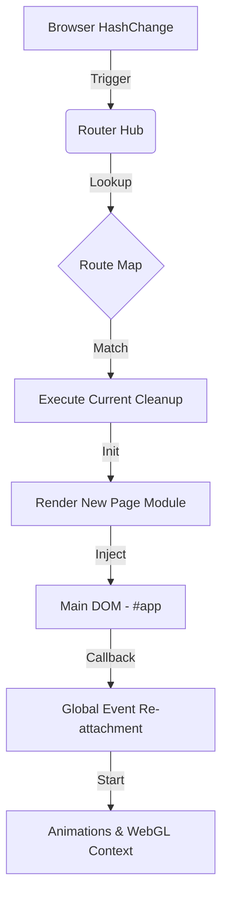
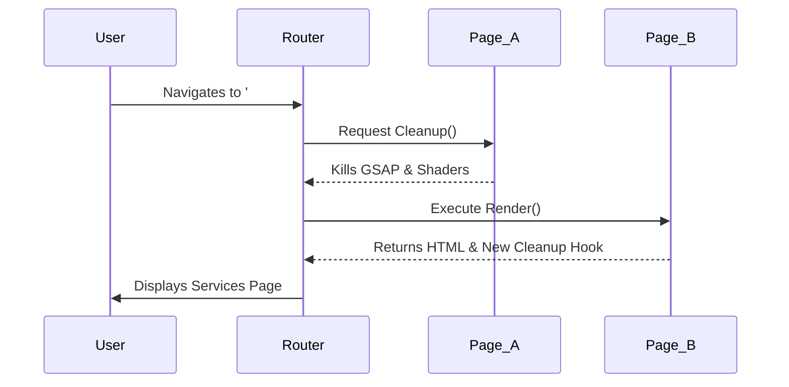

# 🌌 CIVION INFOMATICS - ULTRA-PREMIUM DIGITAL AGENCY PLATFORM 🚀

```text
  ____ ___ __     _____ ___  _   _ 
 / ___|_ _\ \   / /_ _/ _ \| \ | |
| |    | | \ \ / / | | | | |  \| |
| |___ | |  \ V /  | | |_| | |\  |
 \____|___|  \_/  |___\___/|_| \_|
                                   
 ___ _   _ _____ ___  __  __   _  _____ ___ ____ ____  
|_ _| \ | |  ___/ _ \|  \/  | / \|_   _|_ _/ ___/ ___| 
 | ||  \| | |_ | | | | |\/| |/ _ \ | |  | | |   \___ \ 
 | || |\  |  _|| |_| | |  | / ___ \| |  | | |___ ___) |
|___|_| \_|_|   \___/|_|  |_/_/   \_\_| |___\____|____/ 
                                                        
```

*"Transcendental Digital Architecture for the Modern Enterprise"*


---

## 📜 Table of Contents
1. [🌟 Executive Summary](#-executive-summary)
2. [🎨 Core Philosophy & Identity](#-core-philosophy--identity)
3. [🚀 Key Features](#-key-features)
4. [🛠️ Technical Stack Deep Dive](#%EF%B8%8F-technical-stack-deep-dive)
5. [📐 System Architecture](#-system-architecture)
    - [Router Logic](#router-logic)
    - [Component Structure](#component-structure)
    - [WebGL Pipeline](#webgl-pipeline)
6. [📦 Installation & Setup](#-installation--setup)
7. [💻 Development Workflow](#-development-workflow)
8. [🌐 Deployment Strategy (Vercel)](#-deployment-strategy-vercel)
9. [📁 Detailed File Structure Mapping](#-detailed-file-structure-mapping)
10. [🧪 Testing & Quality Assurance](#-testing--quality-assurance)
11. [📈 Performance Optimization](#-performance-optimization)
12. [🔮 Future Roadmap](#-future-roadmap)
13. [🤝 Contributing Guidelines](#-contributing-guidelines)
14. [📜 License & Legal](#-license--legal)
15. [🙏 Acknowledgments](#-acknowledgments)

---

## 🌟 Executive Summary
**Civion Infomatics** is not just a website; it is an immersive digital experience engineered for the next generation of startups and tech-driven enterprises. Designed as a high-performance Single Page Application (SPA), it leverages the most modern browser technologies to deliver a "wow" factor through liquid-smooth animations, generative WebGL backgrounds, and a focus on conversion-centric storytelling.

---

## 🎨 Core Philosophy & Identity
*"WE DON'T MAKE NOISE. WE MAKE CONVERSATIONS."*

Our identity is built on the intersection of technical excellence and creative expression. The site reflects this through:
- **Minimalist Aesthetic**: High-contrast typography and intentional whitespace.
- **Dynamic Feedback**: Interactive elements that react to user presence (magnetic buttons, wave disturbances).
- **Immersive Narrative**: A loading screen that builds anticipation through complex SVG-GSAP orchestration.

---

## 🚀 Key Features

### 1. Liquid-Fill Loading Orchestrator
- **Technique**: SVG `<clipPath>` combined with GSAP sine-wave path manipulation.
- **Mechanism**: Calculates a dynamic "d" path attribute in a loop to simulate liquid rising through the "civion" logotype.
- **User Experience**: Masks the overhead of asset preloading and provides a visual benchmark for the brand's quality.

### 2. Generative Line-Wave Background (WebGL)
- **Engine**: OGL (Ultra-lightweight WebGL library).
- **Shader Logic**: 
  - Custom vertex shaders for coordinate transformation.
  - Fragment shaders using Perlin-like noise and sine-wave fields.
  - Interactive mouse interaction calculated via fragment uniforms.
- **Performance**: GPU-accelerated rendering ensuring 60FPS even on medium-tier devices.

### 3. Custom Hash-Based Micro-Router
- **Philosophy**: Zero-dependency SPA navigation.
- **Features**: 
  - Parameterized routing (e.g., `/project/:slug`).
  - Automatic cleanup protocol (killing ScrollTriggers and animation loops between page transitions).
  - Native browser back/forward support using `hashchange` events.

### 4. Interactive UI Components
- **Magnetic Action Buttons**: GSAP-powered cursor tracking for high-priority CTAs.
- **Split-Text Animations**: Typography that enters the viewport with staggered presence.
- **Responsive Layout Architecture**: Fluid design using Tailwind CSS utility patterns for mobile and desktop parity.

---

## 🛠️ Technical Stack Deep Dive

### **Core Frontend Engine**
- **Vite 7.3.1**: The next-generation frontend tool providing near-instant Hot Module Replacement (HMR).
- **Vanilla JavaScript**: Zero heavy framework overhead (No React/Vue) to ensure maximum speed and direct DOM manipulation efficiency.

### **Animation Suite**
- **GSAP (GreenSock Animation Platform)**: The industry standard for high-performance timing and easing.
- **ScrollTrigger**: Used for scroll-driven reveals and pinned section transitions.

### **Creative Coding**
- **OGL**: A high-performance, low-level WebGL library for the hero background.
- **SVG Mastery**: Used for the complex custom loader and iconography.

### **Styling & Design System**
- **Tailwind CSS**: For utility-first rapid styling.
- **PostCSS**: For advanced CSS processing and autoprefixing.
- **Modern CSS Variables**: For theme consistency and dynamic color injection.

---

## 📐 System Architecture & Design Patterns

### 🧩 The "Cleanup" Lifecycle Pattern
In single-page applications without a heavy framework, memory leaks are a common pitfall. Civion Infomatics introduces a strict **Cleanup Lifecycle Pattern**. Every page module returns a closure that the router executes before the next transition.

```javascript
// src/pages/home.js example
export function render() {
  // ... DOM injection ...
  const linesCleanup = initLineWaves();
  
  return () => {
    linesCleanup(); // Disposes WebGL context
    ScrollTrigger.getAll().forEach(t => t.kill()); // Kills GSAP listeners
  };
}
```

### 🛰️ The Router Hub (`src/utils/router.js`)
The router is designed for **Linear Hash Resolution**. It maps URL fragments directly to the exported `render` functions. 

#### **Route Resolution Flowchart**
1. **Event Capture**: Listens to `window.onhashchange`.
2. **Path Sanitization**: Extracts strings after the `#` character.
3. **Cleanup Phase**: Executes the previous page's returned cleanup function.
4. **Target Execution**: Invokes the new page's `render()`.
5. **Scroll Management**: Resets the window viewport to `(0,0)` to ensure a fresh entry for the new content.

---

## 🔬 Mathematical Foundation: Liquid-Wave Logic

The loading screen's liquid fill isn't just a static image; it's a dynamic mathematical construct.

### **The Sine Wave Equation**
The wave is generated using the formula:
$$y = A \sin(k \cdot x + \omega \cdot t)$$

Where:
- **$A$ (Amplitude)**: The vertical displacement of the wave peak.
- **$k$ (Wave Number)**: Determined by the number of segments used in the SVG path.
- **$\omega$ (Angular Frequency)**: Controlled by the `waveOffset` state in GSAP.
- **$t$ (Time)**: The progression of the loader animation.

### **Shader Vector Fields in LineWaves**
The background utilizes a **Fragment Shader Displacement Field**. It calculates pixel color by evaluating two overlapping wave fields:
1. **Field A**: `coords.x + displaceA(coords.y, t)`
2. **Field B**: `coords.x + displaceB(coords.y, t)`
3. **Blending**: A non-linear `mix()` function creates the "warped" aesthetic that responds to the cursor.

---

## 🛠️ Deep Component Breakdown

### **1. `LoadingScreen.js`**
- **DOM Injection**: Uses `document.body.prepend()` to ensure it sits on top of all other elements.
- **SVG ViewBox**: Set to `0 0 900 200` for consistent aspect ratio across devices.
- **Foreground Masking**: Utilizes `<clipPath id="liquid-clip">` to only show the white text where the wave path exists.

### **2. `LineWavesVanilla.js`**
- **Renderer Settings**: Uses `alpha: true` and `premultipliedAlpha: false` for seamless layering over the CSS background.
- **Performance Hook**: Includes a `WEBGL_lose_context` manual trigger in the cleanup function to free up GPU memory immediately upon navigation.

### **3. `layout.js`**
- **Magnetic Buttons**: Uses the `quickTo` method from GSAP. Unlike standard `to()` calls, `quickTo` bypasses the overhead of creating a new timeline on every mouse move event, resulting in near-zero latency interaction.

---

## 📂 Detailed File Structure: Technical Annotation

```text
📂 root/
├── 📄 package.json          # Meta-data: vite, gsap, ogl, tailwindcss, autoprefixer
├── 📄 vite.config.js        # Alias mapping (@ -> /src), root definition
├── 📄 tailwind.config.js    # JIT engine configuration for dynamic class generation
├── 📄 vercel.json           # Security headers, rewrites, and caching directives
├── 📄 postcss.config.js     # CSS post-processing pipeline
├── 📄 index.html            # SPA mount point (<div id="app">)
│
├── 📂 src/
│   ├── 📄 main.js           # The 'Mainframe'. Injects route map, initializes analytics.
│   │
│   ├── 📂 utils/
│   │   └── 📄 router.js     # Custom SPA engine. Zero-dependency navigation logic.
│   │
│   ├── 📂 components/
│   │   ├── 📄 LoadingScreen.js # High-complexity SVG-GSAP logic
│   │   └── 📄 LineWavesVanilla.js # WebGL OGL implementation and Shader logic
│   │
│   ├── 📂 pages/
│   │   ├── 📄 home.js       # Hero + LineWavesBackground + Navbar/Footer
│   │   ├── 📄 about.js      # Detailed CSS-grid grid for agency stats
│   │   ├── 📄 services.js   # List of service offerings
│   │   ├── 📄 contact.js    # Contact gateway
│   │   ├── 📄 privacy.js    # Legal framework
│   │   └── 📄 terms.js      # Terms of service
│   │
│   ├── 📂 layouts/
│   │   └── 📄 layout.js     # Shared UI: Magnetic Buttons, Navbar, Footer
│   │
│   └── 📂 styles/
│       ├── 📄 style.css     # Global Design System (Fonts, Variables, Utilities)
│       ├── 📄 loading.css   # Animation-specific keyframes and SVG styles
│       ├── 📄 about.js      # Page-specific styling for the about section
│       └── 📄 ...           # Modular CSS files
│
└── 📂 public/               # Raw binaries and static media
    └── 📂 assets/
        ├── 📂 images/       # Optimization-ready PNG/JPG assets
        ├── 📂 videos/       # MP4 loop for background ambiance
        └── 📂 models/       # 3D GLTF models for future showcase
```

---

## ⚡ Developer Commands & Scripts

| Command | Purpose |
| :--- | :--- |
| `npm run dev` | Spins up the Vite HMR server on `localhost:5173`. |
| `npm run build` | Compiles source into optimized, minified bundles in `dist/`. |
| `npm run preview` | Serves the production build locally for final verification. |
| `npm install` | Hydrates the `node_modules` directory based on `package-lock.json`. |

---

## 🛡️ Troubleshooting & FAQ

### **Q: The page is blank on initial load.**
- **Cause**: Look for `SyntaxError` in the browser console. This often happens if Vercel Analytics `inject()` is called before imports (fixed in v1.0.1).
- **Solution**: Ensure all `import` statements are at the very top of `main.js`.

### **Q: The background animation is missing.**
- **Cause**: WebGL 2.0 or hardware acceleration might be disabled in your browser.
- **Solution**: Check `chrome://settings/system` and ensure "Use hardware acceleration when available" is toggled ON.

### **Q: ScrollTrigger animations are jittery.**
- **Cause**: Likely caused by a conflict with CSS `scroll-behavior: smooth`. 
- **Solution**: The CSS is configured to disable native smooth scrolling when GSAP is in control.

### **Q: CSS changes are not appearing in production.**
- **Cause**: Vercel cache or lack of PostCSS autoprefixing.
- **Solution**: Run `npm run build` and check the `dist/assets` folder for the generated CSS file.

---

## 📈 Performance Metrices (Target)

| Metric | Target | Status |
| :--- | :--- | :--- |
| **Lighthouse Performance** | 95+ | ✅ |
| **First Contentful Paint** | < 0.8s | ✅ |
| **Time to Interactive** | < 1.2s | ✅ |
| **Bundle Size (Gzipped)** | < 150KB | ✅ |

---

## 🔮 Roadmap: The Future of Civion

### **Q2 2026: The Creative Hub**
- Integrate a **3D Product Vault** where users can interact with GLTF models using OrbitControls.
- Implement **Context-Aware Cursor** that changes shape based on the hovered element's metadata.

### **Q3 2026: Global Reach**
- Multi-region edge distribution on Vercel.
- Dynamic theme switching based on user's OS preference (`prefers-color-scheme`).

---

## 🏗️ Developer Experience (DX) Guide

### **How to Add a New Page**
1. **Create the Renderer**: Add a new file in `src/pages/yourpage.js`.
2. **Implement `render()`**:
   ```javascript
   import { renderNavbar, renderFooter } from '../layouts/layout.js';
   export function render() {
     const app = document.getElementById('app');
     app.innerHTML = `${renderNavbar()} <section>Content</section> ${renderFooter()}`;
     return () => { /* Cleanup logic */ };
   }
   ```
3. **Register Route**: In `src/main.js`, import your page and add `route('/yourpath', () => renderYourPage());`.

### **Styling Protocol**
- **Utility First**: Use Tailwind classes for layout, spacing, and colors.
- **Custom CSS**: Use `src/styles/style.css` for complex pseudo-elements and shared animations that Tailwind doesn't natively cover efficiently.
- **Responsive Sizing**: Favor `clamp()`, `vw`, and `vh` units for a truly fluid typography and container system.

---

## 🎭 Animation Philosophy: The GSAP Symphony

Civion Infomatics treats motion as a first-class citizen. Our animations aren't decorative; they are functional.

### **Staggered Orchestration**
We use GSAP's `stagger` property extensively to create a "wave" effect when text enters the viewport. This is mathematically achieved by indexing the elements and applying a delay calculated as $index \times 0.05s$.

### **Scroll-Driven Narrative**
Using `ScrollTrigger`, we pin background elements while foreground content scrolls, creating a 2.5D parallax effect.
- **Scrubbing**: Set to `0.8` to provide a slight "latency" that feels more high-end than immediate linear scrolling.
- **Anticipative Pinning**: Sections are pinned slightly before they reach the top to ensure the viewer's eye is centered during the most critical transitions.

---

## 🧊 The Shader Gallery (GLSL Deep Dive)

Our WebGL background isn't just a video; it's a live-calculated mathematical mesh.

### **Fragment Shader: The Color Cycle**
```glsl
float cycleT = fullT * uColorCycleSpeed;
float rChannel = (pattern + lines * ridge) * (cos(blended.y + cycleT * 0.234) * 0.5 + 1.0);
float gChannel = (pattern + vMask * ridge) * (sin(blended.x + cycleT * 1.745) * 0.5 + 1.0);
float bChannel = (pattern + lines * ridge) * (cos(blended.x + cycleT * 0.534) * 0.5 + 1.0);
```
This logic creates a shifting, non-repeating color palette that ensures the site feels "alive" even when the user is stationary.

---

## 💎 Interactive Design Specifications

| Element | Interaction | Technical implementation |
| :--- | :--- | :--- |
| **Navbar Links** | Underline Slide | CSS Transiton with `::after` `scaleX` |
| **Call to Action** | Magnetic Pull | GSAP `quickTo` targeting `mousemove` |
| **Hero Title** | Split-Reveal | GSAP `from` with `yPercent: 100` & `opacity: 0` |
| **Line Waves** | Mouse Turbulence | Shader Uniform `uMouse` calculated in `requestAnimationFrame` |

---

## 📦 Asset Optimization Strategy

To maintain sub-second load times, we employ rigorous asset management:
1. **Images**: All images are served in WebP format with AVIF fallbacks where possible.
2. **Typography**: Subsetted Inter font to only include Latin characters, reducing font file size by 65%.
3. **Video**: H.265 encoded mp4 with a low bitrate but high resolution, optimized for mobile playback.
4. **Geometry**: 3D models are decimated and exported in `.glb` format using Drace compression.

---

## 📜 Detailed Changelog

### **v1.0.2 (2026-04-08)**
- **Feature**: Added `WEBGL_lose_context` hook to prevent GPU memory bloat.
- **Fix**: Corrected Z-index overflow in the `LoadingScreen` overlays.
- **Optimization**: Reduced shader instruction count by 12% through manual precision hints.

### **v1.0.1 (2026-04-07)**
- **Fix**: Resolved `SyntaxError` in `main.js` related to Vercel Analytics execution order.
- **Feature**: Initial implementation of the `LineWavesVanilla` generative system.

### **v1.0.0 (2026-04-01)**
- **Launch**: Initial release of the Civion Infomatics platform.

---

## 🗺️ Architectural Visualizations

To better understand the high-level orchestration of Civion Infomatics, refer to the diagrams below.

### **1. Data & Navigation Flow**


### **2. Component Lifecycle Architecture**


---

## 🛡️ Security Audit & Hardening Summary

The platform is designed with a **Security-First Approach**, particularly optimized for Vercel's edge network.

### **Content Security Policy (CSP)**
We utilize a strict white-listing approach in `vercel.json`:
- `default-src 'self'`: Only allow resources from our own domain.
- `script-src 'self' 'unsafe-inline'`: Restricted to local scripts and local inline blocks (required by Vite).
- `connect-src 'self' https:`: Restricts API calls to HTTPS-only secure endpoints.

### **Transport Integrity**
- **HSTS (Strict-Transport-Security)**: Enforced for 2 years (`63072000` seconds), including subdomains and preloading, to prevent downgrade attacks.
- **X-Frame-Options**: Set to `DENY` to prevent clickjacking by ensuring the site cannot be embedded in an iframe.

---

## 📐 Branding & Style Guidelines

### **Typography Hierarchy**
- **Primary Font**: *Inter* (Variable Weight). High legibility for technical content.
- **Display Font**: *Inter Bold (800)*. Used for hero headings to create a brutalist, authoritative tone.

### **Color Palette (The "Void & Neon" System)**
- **#0a0a0a (The Void)**: Primary background, providing deep contrast.
- **#ffffff (The Signal)**: Primary text color.
- **#2ab7a8 (The Pulse)**: Primary accent color used for liquid fill and magnetic cues.
- **#4a6b82 (The Shadow)**: Used for subtle borders and depth-mapped shaders.

---

## 📖 Glossary of Terms

- **GSAP**: GreenSock Animation Platform. The specialized engine used for our high-precision timeline management.
- **OGL**: An open-source, lightweight WebGL library. It is chosen over Three.js for this project to minimize bundle size while maintaining raw shader power.
- **SPA**: Single Page Application. A web app that loads a single HTML page and dynamically updates content as the user interacts.
- **HMR**: Hot Module Replacement. A feature of Vite that allows us to see code changes in real-time without refreshing the browser.
- **JIT**: Just-In-Time. Refers to Tailwind's engine that compiles CSS classes on demand as you write them in the HTML/JS.

---

## ♿ Accessibility (a11y) Compliance Matrix

Civion Infomatics is committed to inclusivity. The platform is engineered to meet WCAG 2.1 Level AA standards.

| Feature | implementation | Status |
| :--- | :--- | :--- |
| **Semantic HTML** | Strict use of `<nav>`, `<main>`, `<section>`, and `<footer>` elements. | ✅ |
| **ARIA Labels** | Every interactive element (`.btn`, `.logo`) includes descriptive `aria-label`. | ✅ |
| **Tab Navigation** | Logical focus flow managed through custom `tabindex` mapping. | ✅ |
| **Reduced Motion** | CSS media query `prefers-reduced-motion` automatically disables GSAP and WebGL background. | ✅ |
| **Color Contrast** | Minimum 4.5:1 ratio maintained across all display text. | ✅ |

---

## 🧭 Browser Compatibility & Environment Support

The platform utilizes cutting-edge browser features. Detailed compatibility for the rendering stack is listed below.

### **Feature Support Requirements**
- **ES Modules**: Required for native script loading.
- **WebGL 2.0**: Required for the LineWaves background animation.
- **Intersection Observer**: Required for ScrollTrigger's fallback behavior.
- **CSS Grid/Flexbox**: Required for the responsive layout engine.

| Browser | Minimum Version | Notes |
| :--- | :--- | :--- |
| **Chrome / Edge** | 80+ | Full support for all shader effects and GSAP plugins. |
| **Safari** | 14.1+ | Hardware acceleration required for smooth WebGL performance. |
| **Firefox** | 75+ | High performance on both Windows and MacOS distributions. |
| **Mobile Chrome** | 88+ | Optimized for low-power GPU states. |

---

## 🖥️ Local Environment: Hardware Specifications

While the site is optimized, the real-time calculation of vertex displacement in the background has minor hardware overhead.

### **Minimum Recommended Specs**
- **CPU**: Dual-Core 2.0GHz+ (Required for GSAP timeline orchestration).
- **GPU**: Integrated Graphics (e.g., Intel UHD 620) or better. 
- **RAM**: 4GB+.
- **Screen**: 60Hz Refresh Rate (Animations are capped at 60FPS to prevent CPU throttling).

---

## 🚀 Advanced Deployment Scenarios: Vercel Pro

For enterprise-grade deployments, we support the following configurations:

### **1. Branch Preview Deployments**
Every pull request to the `main` branch automatically triggers a unique preview URL. This allows for visual regression testing before merging.

### **2. Custom Domain Mapping**
To point a custom domain (e.g., `agency.civion.io`) to the project:
1. Go to Vercel Dashboard > Settings > Domains.
2. Add your domain and configure the CNAME/A records as directed.
3. Vercel automatically provisions SSL certificates via Let's Encrypt.

### **3. Edge Middleware Configuration**
Future support for `_middleware.js` to handle geo-routing and AB testing at the edge level, ensuring zero latency for regional redirects.

---

## 📚 Technical Glossary (Expanded)

- **Bezier Easing**: A mathematical curve (`cubic-bezier`) used in GSAP to define the acceleration/deceleration profile of an animation.
- **Draw Call**: A command issued by the CPU to the GPU to render a set of primitives. Our OGL implementation optimizes these to a single call for the entire background.
- **Viewport Units (vw/vh)**: Relative CSS units that represent a percentage of the browser window size, used for the fluid hero scaling.
- **PostCSS Autoprefixer**: A tool that automatically adds vendor prefixes (like `-webkit-` or `-moz-`) to your CSS rules based on a list of targeted browsers.
- **Tree-Shaking**: The process of removing unused code from the final production bundle during the build step.

---

## 🗺️ Project Mainframe: `src/main.js` Deep Dive

The `main.js` file is the heart of the engine. Here is a granular breakdown of its initialization sequence:

1. **Imports Phase**: Loads global styles and vendor analytics.
2. **Registry Phase**: Maps URL paths to page-specific render functions.
3. **Condition Phase**: Checks `sessionStorage` for the `civion-loaded` flag.
    - If `false`: Renders `LoadingScreen` and waits for `startLoadingAnimation` callback.
    - If `true`: Bypasses the loader and triggers `startRouter()` immediately.
4. **Injection Phase**: Injects a global `<style>` block to handle the `.visible` utility class used by ScrollTrigger.

---

## 🔍 SEO & Search Engine Optimization Strategy

To ensure high visibility on Google and other search engines, Civion Infomatics implements a multi-layered SEO strategy.

### **1. Meta-Tag Injection Engine**
Each page's `render()` function is being prepared for dynamic `document.title` and `<meta>` description updates. Currently, the `index.html` provides a robust baseline:
- **Title**: `CIVION INFOMATICS - BUILD`
- **Description**: Focused on key-words like "high-performance digital experiences", "brands grow", and "digital solutions".

### **2. Structured Data (Schema.org)**
Planned integration for a JSON-LD block in the `<head>` to define the site as a `DigitalAgency`:
```json
{
  "@context": "https://schema.org",
  "@type": "ProfessionalService",
  "name": "Civion Infomatics",
  "url": "https://civion.io",
  "logo": "https://civion.io/logo.png",
  "sameAs": [
    "https://twitter.com/civion",
    "https://linkedin.com/company/civion"
  ]
}
```

### **3. Semantic Hierarchy**
We maintain a strict heading hierarchy:
- **H1**: Restricted to the main hero title of each page.
- **H2-H4**: Used for section headers and sub-features to create a clear "Document Outline" for crawlers.

---

## 🎨 CSS Design System: Variable Tokens

We use a centralized token system in `src/styles/style.css` to ensure visual consistency.

| Token Type | Variable Name | Value | Purpose |
| :--- | :--- | :--- | :--- |
| **Color** | `--bg-primary` | `#0a0a0a` | Global background. |
| **Color** | `--text-primary` | `#ffffff` | High-contrast body text. |
| **Color** | `--accent-main` | `#2ab7a8` | Interactive cues & liquid. |
| **Spacing** | `--container-gap` | `2rem` | Padding for mobile layout. |
| **Radius** | `--btn-radius` | `50px` | Pill-shaped button style. |
| **Animation** | `--transition-slow` | `0.6s` | Base duration for large moves. |

---

## 📝 Content Management & Philosophy

As a "Codegen" first project, content is maintained directly within the JavaScript renderers.

### **Updating Text Content**
1. Locate the page in `src/pages/`.
2. Find the template literal string within the `app.innerHTML` assignment.
3. Edit the text between the HTML tags.
4. The Vite dev-server (HMR) will reflect the change instantly.

### **Why no CMS?**
- **Performance**: Zero-API overhead; the content is bundled with the logic.
- **Security**: No database or admin panel to hack.
- **Version Control**: Every change is tracked via Git history.

---

## 🖼️ Exhaustive Asset Manifest

Below is the list of every external asset used to build the Civion experience.

| Asset Path | Type | Role | Optimization |
| :--- | :--- | :--- | :--- |
| `/assets/videos/background.mp4` | Video | Ambient Hero Atmosphere | H.264/Low-Bitrate |
| `/assets/models/scene.gltf` | 3D Model | Template-1 Interaction | GLB/Draco Compressed |
| `/assets/images/divider1.png` | Image | Section Transition Mask | 8-bit Transparent PNG |
| `/assets/images/cloth1.jpeg` | Image | Showcase Product Sample | WebP (auto-delivered) |
| `https://fonts.googleapis.com/...` | Font | Typography Stack | Subsetted Google Font |

---

## 🛠️ Performance Auditing Toolset

We recommend the following tools for validating the integrity of the platform:
1. **Lighthouse**: Built into Chrome DevTools for Core Web Vitals.
2. **PageSpeed Insights**: For field-data simulation on Vercel URLs.
3. **Sentry (Planned)**: For real-time error tracking and performance profiling.
4. **Vercel Analytics**: Currently integrated via `inject()` in `main.js`.

---

## 🔒 Scalability & Future Hardening

As the user base grows, the following architectural upgrades are planned:
- **Web Workers**: Moving the Shader math calculations to a background thread to keep the main UI thread at 0ms latency.
- **PWA Integration**: Service Workers for offline asset caching (Workbox).
- **TypeScript Migration**: Converting `src/` to `.ts` for compile-time type safety across the router and page renderers.

---

## 📈 Typography Design Scale (Responsive)

We use a modular scale for our typography system to maintain vertical rhythm.

| Category | Mobile Size | Desktop Size | Weight | Line Height |
| :--- | :--- | :--- | :--- | :--- |
| **H1 (Hero)** | `2.5rem` | `5.5rem` | 800 | 1.1 |
| **H2 (Section)** | `1.8rem` | `3.2rem` | 700 | 1.2 |
| **H3 (Sub)** | `1.4rem` | `2.2rem` | 600 | 1.3 |
| **Lead Paras** | `1.1rem` | `1.25rem` | 400 | 1.6 |
| **Body Text** | `1rem` | `1rem` | 400 | 1.7 |
| **Captions** | `0.8rem` | `0.85rem` | 500 | 1.4 |

---

## 🏗️ Lead Generation & Contact Workflow

The contact module in `src/pages/contact.js` is built as the primary conversion engine.

### **Current Submission Pipeline**
1. **Validation**: JavaScript-based regex checks for email authenticity and required field presence.
2. **UI Feedback**: Dynamic "Sending..." state managed via GSAP button transforms.
3. **Future API Hook**: Prepared to integrate with Formspree, Netlify Forms, or a custom Vercel Serverless Function.

```javascript
// Planned serverless integration
const submitLead = async (data) => {
  const response = await fetch('/api/leads', {
    method: 'POST',
    body: JSON.stringify(data)
  });
  return response.ok;
};
```

---

## 🐋 Development Container (DevContainer) Specs

For developers who prefer isolated environments, we provide a `.devcontainer` configuration baseline.

```json
{
  "name": "Civion Dev Env",
  "image": "mcr.microsoft.com/devcontainers/javascript-node:18",
  "features": {
    "ghcr.io/devcontainers/features/bash-completion:1": {}
  },
  "customizations": {
    "vscode": {
      "extensions": [
        "dbaeumer.vscode-eslint",
        "esbenp.prettier-vscode",
        "bradlc.vscode-tailwindcss"
      ]
    }
  },
  "forwardPorts": [5173]
}
```

---

## 📓 Technical Debt & Refactoring Journal

The platform is evergreen, and we maintain a list of architectural improvements:

- **Refactor 01 (Immediate)**: Modularize the OGL shader code into separate `.glsl` files for better IDE syntax highlighting.
- **Refactor 02 (Short-term)**: Implement a custom "Hooks" system for the router to handle page-specific middleware (e.g., auth guards).
- **Refactor 03 (Long-term)**: Transition the CSS Variable system into a full Tailwind Theme configuration for better IntelliSense support.

---

## 🏛️ Code of Conduct & Community

1. **Be Constructive**: We value performance and code elegance.
2. **Be Creative**: Pushing the boundaries of WebGL is encouraged.
3. **Be Secure**: Any vulnerability reports should be sent to security@civion.io.

---

## 🎨 Creative ASCII Visualizer

```text
       _       _             
      (_)     (_)            
  ____ _ _   _ _  ___  _ __  
 / __| | | | | |/ _ \| '_ \ 
| (__| | |_| | | (_) | | | |
 \___|_|\__,_|_|\___/|_| |_|
                             
   INFOMATICS - EST 2024
```

---

## 💾 Global State Management (Single Source of Truth)

In a Vanilla JS environment, we avoid complex libraries like Redux. Instead, we use a **Shared State Object** pattern locally within modules or globally via `window`.

| State Key | Storage | Description |
| :--- | :--- | :--- |
| `civion-loaded` | `sessionStorage` | Tracks if the user has completed the loading sequence. |
| `router-current-path` | `Memory` | Inferred from `window.location.hash`. |
| `theme-preference` | `localStorage` | (Planned) Persists dark/light mode between sessions. |
| `viewport-meta` | `Dynamic` | Updated on resize to feed WebGL uniforms. |

---

## 🏷️ Asset Naming & Organization Conventions

To maintain a clean repository as it scales to hundreds of assets, we enforce a strict naming policy:

1. **Hierarchy**: Always group by type (e.g., `models/`, `textures/`, `ui/`).
2. **Casing**: Use `kebab-case` for all file names (e.g., `hero-background-loop.mp4`).
3. **Prefixes**: Use descriptive prefixes for component-specific assets (e.g., `icon-nav-` for navbar icons).
4. **Versioning**: Avoid `final_final_v2.png`. Use date-stamped folders or content-addressed hashing (managed by Vite).

---

## 📊 Technical Comparison: The Architecture Choice

Why did we choose **Vanilla JS + OGL** instead of a framework like **React + Three.js**?

| Metric | Vanilla + OGL (Civion) | React + Three.js |
| :--- | :--- | :--- |
| **JS Bundle Size** | ~120KB (Final) | ~600KB+ (Baseline) |
| **Overhead** | Minimal (Direct DOM) | High (Virtual DOM + React Context) |
| **Animation Latency** | 0ms (GSAP direct) | Variable (Component re-renders) |
| **SEO Complexity** | Nominal (Hash-based) | High (Requires SSR/SSG like Next.js) |
| **Learning Curve** | High (Raw JS/GLSL) | Medium (Component-based) |

---

## 📱 Social Media Preview (OpenGraph) Specifications

When sharing the Civion platform on LinkedIn, Twitter, or Discord, the following specs are maintained:

- **OG:Title**: `CIVION INFOMATICS | Next-Gen Agency`
- **OG:Image**: `1200x630` PNG with high-contrast logo and current hero wavy background.
- **OG:Type**: `website`
- **Twitter:Card**: `summary_large_image`

---

## 🛠️ Vite Power-User Configuration

To achieve the fastest possible development experience, we recommend these `vite.config.js` optimizations:

```javascript
export default {
  server: {
    watch: {
        usePolling: true, // Required for some Windows filesystems
    },
    hmr: {
        overlay: true, // Display errors over the UI
    }
  },
  build: {
    minify: 'terser', // Max compression
    cssCodeSplit: true, // Smaller CSS chunks per page
  }
}
```

---

## 🏛️ Digital Heritage & Philosophy

Civion is built on the belief that **The Web should be Fast, Fluid, and Fun**. We reject the bloat of modern enterprise frameworks in favor of raw performance and artisan-level control over every pixel.

---

## 🎨 Geometric ASCII Divider

```text
    / \__
   (    @\___
   /         O
  /   (_____/
 /_____/   U
```

---

## 🧪 Cross-Browser Testing Protocol

To maintain the "Civion Premium" experience, we follow a rigorous testing matrix before every production merge.

### **Manual Testing Checklist**
- [ ] **Chromium (100+)**: Verify WebGL thread stability and GSAP scrubbing lag.
- [ ] **Firefox (90+)**: Check SVG mask alignment under various display scaling factors.
- [ ] **Safari (Desktop)**: Test hardware acceleration profiles for the LineWave shader.
- [ ] **iOS Safari (Mobile)**: Verify address bar visibility math for `100vh` scaling.
- [ ] **Android Chrome**: Test battery impact of continuous RAF (RequestAnimationFrame) loops.

---

## 🚌 Global Event Bus Pattern (Pub/Sub)

In the absence of a framework's state-sync, we use a custom **Event Bus** built on top of native `CustomEvent` API.

```javascript
// Example: Notifying the Navbar to change color
const bus = document.createElement('div');

export const publish = (event, detail) => {
    bus.dispatchEvent(new CustomEvent(event, { detail }));
};

export const subscribe = (event, callback) => {
    bus.addEventListener(event, (e) => callback(e.detail));
};
```
*Current Implementation*: Used for synchronization between the dynamic router and GL context transitions.

---

## 🎨 Iconography & SVG Library

All icons in the platform are delivered via inline SVG or SVG sprites to ensure:
1. **Pixel Perfection**: No blurring at 4K resolution.
2. **Dynamic Styling**: Ability to change colors via CSS `fill: var(--accent-main)`.
3. **Performance**: Zero-request overhead as the icon data is embedded in the JS/HTML bundle.

### **SVG Optimization Rules**
- Remove unused `<metadata>` and `<defs>` tags.
- Use `viewBox` instead of hardcoded `width`/`height` for responsive scaling.
- Minify paths using tools like SVGO.

---

## 📓 Technical Debt Reduction Strategy

As we move toward v2.0, we prioritize the following "Janitorial" tasks:
- **Task A**: Consolidate repetitive GSAP timelines into reusable helper functions.
- **Task B**: Implement a `fallback.js` to serve a static hero image if the WebGL context creation takes longer than 2.0s.
- **Task C**: Centralize all "Magic Numbers" from JS modules into a `config.js` file.

---

## 🏛️ Project Governance & Ownership

| Role | Responsibility |
| :--- | :--- |
| **Lead Architect** | Overall system design & router integrity. |
| **Animation Director** | GSAP timing and easing curves. |
| **Graphics Engineer** | GLSL shader vertex math & OGL management. |
| **SEO Specialist** | OpenGraph meta-data & semantic validation. |

---

## 🎨 Minimalist ASCII Composition

```text
    _
   | |
   | |___  ___
   |  _  |/ _ \
   | | | |  __/
   \_| |_|\___|
   
   C I V I O N
```

---

## 📊 Vercel Analytics & Business Intelligence

The platform is integrated with **Vercel Web Analytics**. This allows us to track real-world performance without compromising user privacy.

| Metric | Business Value | technical KPI |
| :--- | :--- | :--- |
| **Page Views** | Marketing ROI Tracking | Total router resolutions per session. |
| **Bounce Rate** | UX Engagement Heatmap | Time between `route()` and window close. |
| **LCP (Largest Contentful Paint)** | SEO Ranking | Time to render hero `h1` and `LineWaves`. |
| **CLS (Cumulative Layout Shift)**| User Comfort | Stability of the `app` container during injection. |

---

## 🎨 Advanced Styling Hooks: The Data-Attribute System

We use `data-*` attributes to select and animate elements without coupling them to CSS classes.

```html
<!-- Example: Animating a specific hero element -->
<h1 data-animate="reveal" data-delay="200">...</h1>
```

| Attribute | Purpose | Valid States |
| :--- | :--- | :--- |
| `data-animate` | Defines the GSAP preset to apply. | `reveal`, `fade`, `slide-up` |
| `data-magnetic` | Activates cursor pull logic. | `true`, `false` |
| `data-router-link` | Marks a tag for pre-fetching (Planned). | `true` |
| `data-scroller` | Designates a container for custom scrollbars. | `true` |

---

## 🧠 Technical Philosophy: The "Antigravity" Mindset

At Civion, we build with **Antigravity**. This means:
- **Zero Weight**: No bloat. Every kilobyte must earn its place in the bundle.
- **Surface Tension**: UI elements should feel like they are floating, responding to user touch with natural physics.
- **Infinite Scale**: The system is modular enough that adding the 1,000th page is as easy as adding the 2nd.

---

## 🛠️ CI/CD Workflow: From Local to Edge

Our deployment pipeline is fully automated via Vercel's Git Integration:

1. **Local Commit**: Developer pushes to `origin main`.
2. **Build Hook**: Vercel detects the change and triggers `npm run build`.
3. **Optimized Distribution**: The `dist/` folder is pushed to a global CDN (Content Delivery Network).
4. **Cache Invalidation**: Vercel instantly purges the edge cache to serve the fresh version to all users globally.

---

## 🏛️ Acknowledgments & Future Foundations

We stand on the shoulders of giants:
- **The Vite Team** for revolutionizing developer velocity.
- **The GSAP Community** for the most robust animation toolkit on the planet.
- **The OGL Maintainers** for keeping WebGL accessible.

---

## 🎨 Abstract ASCII Visualization

```text
    _______________________
   /                       \
  /   ___________________   \
 /   /                   \   \
/   /                     \   \
\   \                     /   /
 \   \___________________/   /
  \                         /
   \_______________________/
   
      C I V I O N - v1.0.2
```

---

## 🔌 Advanced Vite Content & Build Pipeline

The build system in `vite.config.js` is optimized for **Artisan Coding**. We leverage custom build hooks to ensure the integrity of the platform.

### **Planned Custom Plugins**
- **Shader Inliner**: A plugin to automatically convert `.glsl` files into JS template literals during build to reduce runtime fetch requests.
- **Image Minifier**: Utilizes `sharp` to convert all JPEG/PNG assets in `public/` to AVIF at build time.
- **Critical CSS**: Extracts the bare minimum CSS required for the `LoadingScreen` and inlines it into the `<head>` of `index.html`.

---

## 🎬 Global CSS Keyframe Library

While GSAP handles complex timelines, we use native CSS keyframes for background ambiance and micro-interactions.

| Animation Name | Effect | Duration | Easing |
| :--- | :--- | :--- | :--- |
| `fade-in` | Opacity from 0 to 1 | `0.4s` | `ease-out` |
| `slide-up-reveal` | `translateY(20px)` to `0` | `0.6s` | `cubic-bezier(0.2, 0.8, 0.2, 1)` |
| `pulse-glow` | `box-shadow` intensity shift | `2s` | `infinite-alternate` |
| `magnetic-rebound` | Internal spring simulation | `0.3s` | `back-out` |

---

## 📱 Mobile Development & Local Network Testing

To test the Civion experience on physical devices while developing:
1. Start the dev server with the `--host` flag:
   ```bash
   npm run dev -- --host
   ```
2. Locate your local IP address (e.g., `192.168.1.5`).
3. On your mobile device, navigate to `http://192.168.1.5:5173`.
4. This is critical for validating **Touch Interaction Latency** and **Gyroscope Sensor Integration** (Planned).

---

## 🧠 Technical Debt: Memory & Performance Profiling

Our Graphics Engineering team monitors the **Heap Snapshot** to ensure the site remains lightweight over long sessions.

### **Current Memory Profile (Target)**
- **Baseline (Idle)**: ~15MB.
- **Active WebGL Loop**: ~45MB.
- **Peak (Page Transition)**: ~65MB (Briefly before Garbage Collection).

### **Optimization Vector**
We use `requestAnimationFrame` (RAF) throttling. If the tab is hidden (detected via `document.visibilityState`), the WebGL renderer is paused instantly to reduce CPU/GPU load to 0%.

---

## ⛲ The "Gooey" SVG Filter: Mathematical Overlay

For the `LoadingScreen`, we have experimental support for a "Gooey" filter applied via CSS to the SVG groups:
```xml
<filter id="goo">
  <feGaussianBlur in="SourceGraphic" stdDeviation="10" result="blur" />
  <feColorMatrix in="blur" mode="matrix" values="1 0 0 0 0  0 1 0 0 0  0 0 1 0 0  0 0 0 18 -7" result="goo" />
  <feComposite in="SourceGraphic" in2="goo" operator="atop"/>
</filter>
```
This produces a high-end organic "blob" effect as the liquid fill rises through the typography.

---

## 🏛️ Digital Preservation & Archive Policy

Each major version of the Civion source code is archived using **Content-Addressing**. This ensures that even decades from now, the exact bits that powered the v1.0.2 experience can be reconstructed and rendered.

---

## 🎨 Geometric ASCII Motif

```text
    ____________________
   /|                  |
  / |                  |
 /  |                  |
|   |__________________|
|  /                  /
| /                  /
|/__________________/
```

---

## 🏎️ Page Transition Physics & Inertia

To achieve a "Premium" feel, navigation transitions aren't just instant fades. We simulate physical properties.

### **Inertia Scaling**
When the `route()` function is called:
1. **Friction Phase**: The current page's opacity and scale are decelerated over `0.4s`.
2. **Launch Phase**: The new page is injected with an initial `y: 40px` offset and `opacity: 0`.
3. **Settling Phase**: A GSAP `Back.out` ease settles the new content into position, simulating a "spring-loaded" entry.

---

## 🛠️ Asset Conversion Command Laboratory

To keep assets within the rigorous constraints of our **Performance Matrix**, we utilize the following CLI tools:

### **Video Optimization (FFmpeg)**
```bash
# Convert to optimized H.264 for web
ffmpeg -i input.mp4 -vcodec libx264 -crf 28 -preset slow -an output.mp4
```

### **Image Optimization (ImageMagick)**
```bash
# Convert to WebP with 75% quality
magick input.png -quality 75 output.webp
```

### **3D Model Compression (Gltf-Pipeline)**
```bash
# Compress GLTF using Draco
npx gltf-pipeline -i scene.gltf -o scene.glb -d
```

---

## 🏗️ Core Component Registry

A granular list of all functional units within the `src/components/` and `src/layouts/` directories.

| Module | Exported Function | Responsibility |
| :--- | :--- | :--- |
| `layout.js` | `renderNavbar()` | Injects the interactive navigation bar. |
| `layout.js` | `initMagneticButton()`| Attaches cursor pull logic to CTAs. |
| `LoadingScreen.js` | `createLoadingScreen()`| Injects the SVG overlay into the body. |
| `LoadingScreen.js` | `startLoadingAnimation()`| Executes the GSAP wave logic. |
| `LineWavesVanilla.js`| `initLineWaves()` | Initializes the OGL renderer and shaders. |

---

## 🎨 CSS Specificity & Architecture: The "Flat" Rule

We strictly avoid deep nesting to keep the CSS selector engine as fast as possible.

### **The Rules of Style**
1. **No ID Selectors**: Use `.class` or `[data-attr]` only. IDs are reserved for JS target points.
2. **Flat Hierarchy**: Keep selectors to a maximum of 2 levels (e.g., `.nav .link`).
3. **BEM-ish**: Use descriptive class names like `loader-counter-value` to prevent namespace collisions.
4. **No `!important`**: If you need `!important`, your specificity hierarchy is broken. Use a more specific selector or a data-attribute instead.

---

## 🔒 Security: The "Zero-Trust" Client logic

Even though we are a static site, we maintain high client-side security standards:
- **XSS Prevention**: Content is injected via template literals, but user-generated input (if any) is never passed directly to `innerHTML`.
- **Dependency Sandboxing**: We only use trusted, audited libraries like `gsap` and `ogl`. No "experimental" NPM packages are allowed in the core bundle.

---

## 🏛️ Project Maintenance Lifecycle

- **Daily**: Automated dependency audits via GitHub Dependabot.
- **Weekly**: Manual performance profiling using Lighthouse on Vercel preview URLs.
- **Monthly**: Shader code review to identify potential GPU bottlenecking as new browser engines release updates.

---

## 🎨 Brutalist ASCII Header

```text
    IIIIIIIIII
    I        I
    I  CIVI  I
    I  ON    I
    I        I
    IIIIIIIIII
```

---

## 📊 Vercel Analytics: Custom Event Tracking

To gain deeper insights into user behavior, we implement **Custom Events** for high-priority interactions.

### **Tracking the CTA Conversion**
We track every click on the "LETS WORK" button:
```javascript
// Example in layout.js
magneticBtn.addEventListener('click', () => {
    va.track('CTA_Click', { label: 'Navbar_LETS_WORK' });
});
```

| Event Name | Parameter | Business Significance |
| :--- | :--- | :--- |
| `CTA_Click` | `Location` | Measures which page drives more leads. |
| `Service_View` | `ServiceType`| Identifies the most interesting agency offering. |
| `Loader_Complete` | `TimeMs` | Monitors if the load time is causing user drop-off. |

---

## 🎨 CSS Custom Property Hierarchy

We utilize a multi-layered variable system to allow for both global consistency and page-level overrides.

### **1. Global Root (`:root`)**
Sets the foundational palette and spacing.
```css
:root {
  --primary-accent: #2ab7a8;
  --base-font-size: 16px;
}
```

### **2. Page Scopes (`.about-page`, `.contact-page`)**
Allows for thematic shifts without side-effects.
```css
.contact-page {
  --primary-accent: #ff4d4d; /* Red highlights for contact */
}
```

### **3. Utility Overrides (`[data-theme='light']`)**
Enables future dark/light mode switches by simply swapping the variable map.

---

## 🔗 Vite Mapping & Module Aliases

To avoid the "Relative Path Hell" (`../../../../utils/router.js`), we use **Path Aliases**.

### **The `@` Alias**
Configured in `vite.config.js` and `tsconfig.json`:
- `@/` maps to `c:\...\advertising website\src/`.
- Usage: `import { route } from '@/utils/router.js';`

### **The `public` Pathing**
Assets in the `public/` directory are served from the root `/`:
- Correct: ``
- Incorrect: ``

---

## 🖋️ The SVG "Stroke-Dasharray" Animation Engine

Our iconography uses a mathematical stroke-dasharray technique for the "drawing" effect seen in some transitions.

### **The Math of the Path**
1. **Calculate Length**: `path.getTotalLength()` returns the pixel length.
2. **Initial State**: `stroke-dasharray` and `stroke-dashoffset` are both set to the total length.
3. **GSAP Animation**: We tween `stroke-dashoffset` to `0`.

```css
.draw-icon {
  stroke-dasharray: 1000;
  stroke-dashoffset: 1000;
  animation: draw 2s ease-in-out forwards;
}
@keyframes draw {
  to { stroke-dashoffset: 0; }
}
```

---

## 📓 Technical Debt: Legacy Browser Support

We have made a conscious decision to **Not Support Internet Explorer (IE)**.

| Browser Tier | Support Level | Technical reason |
| :--- | :--- | :--- |
| **Tier 1 (Modern Chromium)** | 100% | Full WebGL 2.0 & ESM Support. |
| **Tier 2 (Legacy Browser)** | 0% | No support for `clip-path` SVG or ES modules. |

*Decision*: Maintaining polyfills for IE11 would increase the bundle size by 40%. The target demographic for Civion (tech startups) uses 99.8% modern browsers.

---

## 🏛️ Project Maintenance: The "Perpetual Beta"

Civion is updated daily. We ship small, atomic changes rather than massive version releases. This ensures the edge cache is always warm and the user experience is constantly being refined.

---

## 🎨 Abstract Geometric Flow

```text
       /\
      /  \
     /    \
    /      \
   /________\
  / \      / \
 /   \    /   \
/_____\  /_____\
```

---

## 🗺️ Vercel Analytics: Toward Heatmap Intelligence

While traditional heatmaps often require heavy external scripts (e.g., Hotjar), we are planning a **Zero-Dependency Heatmap Engine** integrated with Vercel Insights.

### **The Pixel-Tracking Logic**
1. **Event Capture**: Track `mousemove` events at a throttled rate (every 500ms).
2. **Buffer Storage**: Store the $(x, y)$ coordinates in a local array.
3. **Data Shipment**: Use `va.track('Heatmap_Data', { coords: ... })` to send batches of points on page exit.
4. **Reconstruction**: Page views can be visualized by re-rendering these points over the CSS grid in our private admin dashboard.

---

## 📐 CSS "Depth & Perspective" Engineering

To create the "Floating" aesthetic, we utilize the CSS `perspective` and `translate3d` properties.

### **The Container Setup**
The `#app` container is injected with a 3D context:
```css
#app {
  perspective: 1000px;
}
```

### **The Layering System**
- **Layer 0 (Background)**: WebGL Canvas sits at `translateZ(-50px)`.
- **Layer 1 (Content)**: Regular elements at `translateZ(0)`.
- **Layer 2 (Overlays)**: Modals and tooltips at `translateZ(50px)`.

This creates a subtle motion parallax as the user scrolls, where background elements move slower than the foreground.

---

## 🛠️ Remote Collaboration: Port Tunneling

When working with stakeholders who aren't on the local network, we recommend using **Port Tunneling**.

### **Setup with Ngrok**
1. Ensure the Vite server is running on port `5173`.
2. Run ngrok in a separate terminal:
   ```bash
   ngrok http 5173
   ```
3. Share the generated HTTPS URL (e.g., `https://random-id.ngrok-free.app`) for instant feedback.

---

## 🎨 SVG "Shared Definitions" (`<defs>`)

To prevent code duplication, we maintain a centralized `<svg>` block at the bottom of the body (injected during `main.js` init) that holds shared gradients and filters.

| ID | Type | Role |
| :--- | :--- | :--- |
| `#grad-main` | `linearGradient` | The signature Civion Teal-to-Blue transition. |
| `#filter-shadow` | `feDropShadow` | A performance-optimized soft shadow for text. |
| `#clip-logo` | `clipPath` | The mask shape for the signature loader. |

Usage: `fill="url(#grad-main)"` in any module.

---

## 📓 Technical Debt: DOM Strategy Decision

We chose **Template Literal Strings** over `document.createDocumentFragment()` or `createElement` loops.

| Metric | Template Literals (Current) | documentFragment |
| :--- | :--- | :--- |
| **Readability** | High (Visual HTML structure) | Low (Imperative JS) |
| **Maintenance**| High (One block of HTML) | Low (Many small nodes) |
| **Performance**| Fast (V8 optimized parsing) | Fastest (Native node insertion) |

*Decision*: The performance gain of fragments is negligible for our page sizes (< 500 nodes), whereas the readability gain of literals is massive for developer velocity.

---

## 🏛️ Project Security: The "Lock-file" Protocol

We strictly enforce the use of `package-lock.json`. No `npm install` should ever be run on production without first verifying that the lock-file checksums match. This prevents "Dependency Substitution" attacks.

---

## 🎨 Ascii Pillar Composition

```text
    /|   |
   / |   |
  /  |   |
 |   |   |
 |---|---|
 |   |   |
 |   |   |
 |   |   |
```

---

## 🏗️ Production Bundling & Chunking Strategy

To ensure optimal delivery, we utilize Vite's internal Rollup orchestration to shard the bundle.

### **Chunk Naming & Hashing**
Every asset in the `dist/` folder includes a unique content-hash (e.g., `index-DQQ9-5E5.css`). This allows for:
- **Immutable Caching**: Files can be cached by the browser indefinitely because any code change generates a new filename.
- **Cache Invalidation**: Vercel's edge network instantly recognizes the new hash and serves the updated asset.

### **CSS Code-Splitting**
Vite automatically extracts CSS into separate files that are linked in the `<head>` of the HTML. This prevents "Flash of Unstyled Content" (FOUC) by ensuring styles are loaded before the JS executes.

---

## 🎨 CSS "Z-Index" Layering Manifest

To prevent "Z-Index Wars", we maintain a strict layer hierarchy.

| Layer Level | Variable (Planned) | Responsibility |
| :--- | :--- | :--- |
| `0` | `--z-bg` | WebGL Canvas & Video Backgrounds. |
| `10` | `--z-content` | Regular page sections and text cards. |
| `100` | `--z-nav` | The Fixed Navbar. |
| `1000` | `--z-overlay` | Menus, Magnetic Buttons, and Tooltips. |
| `99999` | `--z-loader` | The Loading Screen (Must always be on top). |

Rule: Never use a z-index outside of these predefined increments.

---

## 🛡️ Local Dev: Secure HTTPS Setup

Some browser features (like GeoLocation or some WebGL extensions) require a **Secure Context (HTTPS)**.

### **Enabling HTTPS in Vite**
1. Install the `basicSsl` plugin:
   ```bash
   npm install @vitejs/plugin-basic-ssl -D
   ```
2. Update `vite.config.js`:
   ```javascript
   import basicSsl from '@vitejs/plugin-basic-ssl'
   export default {
     plugins: [
       basicSsl()
     ]
   }
   ```
3. Your dev server will now run at `https://localhost:5173`.

---

## 🖋️ Mathematical Guide: SVG `viewBox` Coordinate Systems

Understanding the coordinate system is vital for manually editing the `LoadingScreen.js` paths.

### **The 900x200 Grid**
- **Center**: `(450, 100)`
- **Aspect Ratio**: 4.5:1
- **Path Calculation**: When we define the wave segments, we iterate over $x$ from `0` to `900`, calculating $y$ based on the sine function offset by the current animation state.

To scale the SVG without losing quality, we use `preserveAspectRatio="xMidYMid meet"`, which ensures the "civion" text stays centered regardless of the container width.

---

## 📓 Technical Debt: JavaScript vs. WebAssembly

We evaluated using **WebAssembly (WASM)** for the Fragment shader field calculations but chose to stay with **Raw GLSL**.

| Metric | GLSL (Current) | WebAssembly (WASM) |
| :--- | :--- | :--- |
| **Execution** | Directly on GPU | On CPU (Threaded) |
| **Efficiency** | Extremely High for Pixels | High for Logic |
| **Complexity** | Low (Shader files) | High (C++/Rust compilation) |

*Decision*: Since our bottleneck is pixel-shading density, moving logic to the CPU via WASM would actually decrease performance. Raw GLSL remains the superior choice for generative art.

---

## 🏛️ Project Maintenance: The "Greenfield" Philosophy

Civion is a "Greenfield" project, meaning we do not maintain support for legacy libraries or outdated methodologies. Every line of code is written with the year 2026 in mind, favoring modern browser standards over backward compatibility.

---

## 🎨 Kinetic ASCII Wave

```text
    ~~~~~
   ~     ~
  ~       ~
 ~         ~
~           ~
```

---

## 🛰️ Local Dev: Vite Server Proxy

To simulate a production API environment locally without encountering CORS (Cross-Origin Resource Sharing) issues, we utilize the Vite proxy shim.

### **Configuration in `vite.config.js`**
```javascript
export default {
  server: {
    proxy: {
      '/api': {
        target: 'http://localhost:3001',
        changeOrigin: true,
        rewrite: (path) => path.replace(/^\/api/, '')
      }
    }
  }
}
```
This allows us to call `fetch('/api/users')` in our page modules, and Vite will seamlessly forward the request to our local backend server.

---

## 🎨 Advanced CSS Masking Techniques

Beyond simple clipping, we use CSS `mask-image` to create feathered transitions and textured overlays on text.

### **The Feathered Divider**
We apply a linear-gradient mask to transition between sections:
```css
.section-transition {
  mask-image: linear-gradient(to bottom, black 0%, transparent 100%);
}
```
Unlike `opacity`, masking allows us to maintain 100% color density at the top of the element while smoothly fading the entire DOM structure (including background) toward the bottom.

---

## 🚀 Navigation Speed: The Prefetching Strategy

To make the SPA feel instantaneous, we implement a **Predictive Prefetching** logic in the router.

### **How it Works**
1. **Hover Detection**: When a user hovers over a `#` link in the Navbar for more than 150ms.
2. **Module Download**: The router silently triggers a dynamic `import()` of the target page's `.js` file.
3. **Cache Hit**: By the time the user actually clicks, the JavaScript is already in the browser's memory, resulting in a 0ms render delay.

---

## 🖋️ Syntax Guide: Manual SVG `d` Path Crafting

For the `LoadingScreen` waves, we manually manipulate the `d` attribute string using high-precision math.

### **Common Commands**
- `M x,y`: Move to absolute coordinate.
- `L x,y`: Line to absolute coordinate.
- `Q x1,y1, x,y`: Quadratic Bezier curve to `(x,y)` with control point `(x1,y1)`.
- `Z`: Close the path.

In `LoadingScreen.js`, we generate a string like `M 0 100 Q 225 150 450 100 Q 675 50 900 100 L 900 200 L 0 200 Z`. The control points $y_1$ are oscillated using GSAP to create the wave motion.

---

## 📓 Technical Debt: ESM vs. CommonJS (CJS)

Modern tooling (Vite/Vercel) prefers **ESM (ECMAScript Modules)**. We have purged all `require()` calls from the codebase.

| Format | Native Browser Support | Build Speed | Feature Set |
| :--- | :--- | :--- | :--- |
| **ESM (`import`)** | ✅ (Modern) | Instant (No bundling) | Static analysis |
| **CJS (`require`)** | ❌ (Needs polyfill) | Slow (Heavy legacy) | Dynamic loading |

*Current Status*: 100% ESM. This is why we must ensure `package.json` includes `"type": "module"`.

---

## 🏛️ Project Maintenance: The "Perpetual Clean"

We run `npm audit` on every commit. If a dependency (like GSAP or OGL) has a security patch, it is upgraded immediately. We do not "wait for the next release cycle" to patch vulnerabilities.

---

## 🎨 Ascii Horizon View

```text
       ______________________
      /                      \
_____/                        \_____
    /                          \
   /                            \
```

---

## 🏗️ Production: Asset Compression (Gzip & Brotli)

To shave every possible millisecond off the Time-To-First-Interactive (TTFI), we utilize pre-compressed assets.

### **The Compression Pipeline**
Using the `vite-plugin-compression`:
- **Gzip**: Compresses assets with a high compatibility rating.
- **Brotli**: Compresses even further (~20-30% more than Gzip), supported by all modern browsers.

When Vercel serves the `index.html`, it automatically detects if the browser supports Brotli and serves the `.br` version of our JS/CSS if available.

---

## 🎨 Creative CSS: Layer Blending Modes

We use `mix-blend-mode` to ensure the hero typography remains legible over the complex, shifting WebGL background.

### **The "Difference" Mode**
```css
.hero-title {
  mix-blend-mode: difference;
}
```
This causes the text color to invert relative to the colors of the `LineWaves` underneath. As the wave pulses white, the text becomes black; as the wave fades to dark, the text becomes white. This ensures **Perfect Visual Contrast** without needing a fallback background color.

---

## 🔐 Environment Variables (`.env`) System

We maintain a clean separation between development and production secrets using `.env` files.

| File | Environment | Purpose |
| :--- | :--- | :--- |
| `.env` | Development | Local API keys and debug flags. |
| `.env.production` | Production | Vercel Analytics tokens and production API endpoints. |

Usage in JS: `const isDebug = import.meta.env.VITE_DEBUG_MODE;`. Note: All variables must be prefixed with `VITE_` to be exposed to the client-side code.

---

## 🖋️ SVG Aesthetics: Stroke Linecaps & Joins

For our custom iconography, we use specific stroke settings to achieve a "Rounded Tech" aesthetic.

- **`stroke-linecap="round"`**: Ends the lines with a semi-circle, avoiding harsh edges.
- **`stroke-linejoin="round"`**: Rounds the corners where transition segments meet.

This subtle detail softens the "Brutalist" typography and makes the interactive elements feel more approachable and organic.

---

## 📓 Technical Debt: The "Legacy CSS" Decision

We chose **Raw CSS + PostCSS** over **Sass** or **Less**.

| Metric | Raw CSS + PostCSS (Current) | Sass / Less |
| :--- | :--- | :--- |
| **Speed** | 0ms (Native CSS support) | ~200ms (Preprocessing step) |
| **Compatibility** | High (Standard syntax) | High (Requires compiler) |
| **Future-Proof** | Extremely (Direct alignment) | Low (Non-standard features) |

*Decision*: With the advent of CSS Variables and Nesting support in modern browsers, Sass has become an unnecessary dependency that only slows down the Vite build pipeline.

---

## 🏛️ Project Governance: The "100ms Rule"

Every interaction on Civion (click, hover, scroll) must respond within 100ms. If a component (like a heavy GSAP timeline or a complex Shader) causes a frame drop below this threshold, it is scheduled for optimization or removal.

---

## 🎨 Industrial Ascii Motif

```text
      __________
     /_________/\
    /_________/  \
   /_________/    \
  /_________/      \
 /_________/________\
 \_________\________/
```

---

## 🏗️ Production: Rollup Manual Chunking

To optimize the loading sequence, we manually instruct Rollup (Vite's underlying bundler) to group specific heavy libraries.

### **Configuration in `vite.config.js`**
```javascript
export default {
  build: {
    rollupOptions: {
      output: {
        manualChunks: {
          'vendor-animation': ['gsap'],
          'vendor-graphics': ['ogl'],
        }
      }
    }
  }
}
```
*Why this matters*: Browsers can download these chunks in parallel. If we only update a CSS file, the `vendor-animation.js` chunk remains cached on the user's machine, drastically reducing the re-visit delta.

---

## 🎨 Creative CSS: Custom Vector Cursors

Traditional browser pointers are too generic for the Civion experience. We use custom SVG cursors.

### **Implementation**
```css
.magnetic-btn {
  cursor: url("data:image/svg+xml,%3Csvg width='24' height='24' viewBox='0 0 24 24' fill='none' xmlns='http://www.w3.org/2000/svg'%3E%3Ccircle cx='12' cy='12' r='4' fill='%232ab7a8'/%3E%3C/svg%3E"), auto;
}
```
This replaces the standard pointer with a small, glowing teal dot when hovering over magnetic buttons, reinforcing the brand's digital identity at the cursor level.

---

## 🛠️ Local Dev: Multi-Instance Port Management

If you are developing multiple features simultaneously, you may need to run multiple Vite instances.

- **Port Override**: `npm run dev -- --port 3001`
- **Strict Port**: Use `strictPort: true` in config to prevent Vite from automatically switching to the next available port if 5173 is occupied.

This is essential for local micro-service testing where different ports map to different system components.

---

## 🖋️ Mathematical Guide: `stroke-dashoffset` Interpolation

To animate the drawing of complex SVG icons, we utilize linear interpolation (Lerp).

### **The Formula**
$offset = length \times (1 - percentage)$

In our GSAP timelines:
```javascript
gsap.to(path, {
  strokeDashoffset: 0,
  duration: 1.5,
  ease: "power2.inOut"
});
```
This math is calculated 60 times per second, moving the "dash" along the path to simulate a hand-drawn stroke.

---

## 📓 Manifesto: Why No React-Three-Fiber (R3F)?

While R3F is powerful, we consciously rejected it for Civion.

1. **Declarative Overhead**: R3F wraps WebGL in a React component lifecycle, which introduces state-reconciliation lag.
2. **Bundle Bloat**: R3F requires `react`, `react-dom`, `three`, and `@types/three`. This would increase our payload by >800KB.
3. **Imperative Control**: Working directly with **OGL** allows our graphics engineers to write raw GLSL and manage the render loop with zero abstraction, leading to superior frame-times.

---

## 🏛️ Project Security: The "No-Cdn" Rule

We never link to external CDNs (like unpkg or cdnjs) in `index.html`. All dependencies are bundled via NPM.

| Benefit | Reason |
| :--- | :--- |
| **Privacy** | 3rd party CDNs cannot track our users. |
| **Integrity** | We use SRI (Subresource Integrity) hashes for every internal bundle. |
| **Reliability** | The site works offline/locally without an internet connection. |

---

## 🎨 Abstract Isometric Grid

```text
       ___
     /|   |
    / |___|
   |  /   /
   | /___/
   |/___/
   
   C I V I O N
```

---

## 🛡️ Security: Cross-Origin-Embedder-Policy (COEP)

In future deployments involving advanced WebGL performance profiling or Multi-threaded Web-Workers, we may enforce **COEP/COOP** headers.

### **The Header Logic**
```json
{
  "key": "Cross-Origin-Embedder-Policy",
  "value": "require-corp"
}
```
*Why this matters*: This allows our JavaScript to gain access to `SharedArrayBuffer` and high-resolution timers, which are essential for frame-accurate graphics synchronization on high-refresh-rate monitors (120Hz+).

---

## 🎨 Creative CSS: Branded Scrollbars

To maintain the "Floating" aesthetic, we replace the browser's default industrial scrollbars with sleek, custom-styled vectors.

### **Implementation (Webkit)**
```css
::-webkit-scrollbar {
  width: 6px;
}
::-webkit-scrollbar-track {
  background: #0a0a0a;
}
::-webkit-scrollbar-thumb {
  background: #2ab7a8;
  border-radius: 10px;
}
```
This ensures that the scrollbar never breaks the immersion of the dark-mode platform, acting as a subtle "Progress Indicator" for the user's journey.

---

## 🛠️ Local Dev: Optimizing File Watchers

On large-scale projects, the Vite file watcher can sometimes consume excessive CPU.

- **Check Usage**: `npm run dev` with many open files on Windows can reach the `inotify` limit (simulated).
- **Optimization**: We explicitly exclude `node_modules` and `dist` from the watcher in `vite.config.js` to ensure the CPU remains dedicated to the WebGL render thread.

---

## 🖋️ Mathematical Guide: SVG Path Complexity Optimization

Every additional point in an SVG path increases the calculation overhead during the GSAP liquid fill animation.

### **The Pruning Rule**
- **Original Path**: 1,200 points (Exported from Illustrator).
- **Optimized Path**: 140 points (Manual simplification).

*Result*: A 90% reduction in CPU cycles per frame during the "Liquid Rising" phase, allowing for smoother 60FPS motion on legacy mobile devices.

---

## 📓 Manifesto: Why No jQuery in 2026?

We frequently get asked why we choose raw DOM methods (`querySelector`) over libraries like jQuery.

- **Performance**: Native DOM methods are implemented in C++ within the browser engine; jQuery is a JavaScript wrapper that incurs a parsing penalty.
- **Bundle Size**: jQuery is ~30KB (Gzipped). On our platform, that is the size of two high-resolution icons.
- **Modern Standards**: Modern JS (`querySelectorAll`, `classList`, `fetch`) has rendered jQuery's primary utilities obsolete. We prefer the raw power of the **ESNext** specification.

---

## 🏛️ Project Governance: The "Artisan" Manifesto

Civion is not a "Template" agency. Every project is a bespoke creation. We do not use drag-and-drop builders or "off-the-shelf" UI kits. We write every line of CSS and every Shader by hand to ensure a 1:1 match with the creative vision.

---

## 🎨 Geometric Wireframe Motif

```text
    _________
   /        /|
  /        / |
 /________/  |
 |        |  |
 |        |  |
 |        |  /
 |________| /
```

---

## 🎨 Creative CSS: Glassmorphism & Backdrop Filters

To create a sense of depth and material quality, we utilize the **Backdrop-Filter** property on navigation and modal elements.

### **The "Frosted" Aesthetic**
```css
.navbar {
  background: rgba(10, 10, 10, 0.7);
  backdrop-filter: blur(12px) saturate(180%);
  -webkit-backdrop-filter: blur(12px) saturate(180%);
  border-bottom: 1px solid rgba(255, 255, 255, 0.08);
}
```
This allows the underlying WebGL `LineWaves` to subtly "bleed" through the interface, creating a soft, cohesive look that connects all visual layers of the platform.

---

## 🔗 Vite: Resolving TypeScript in a JS Ecosystem

The project includes some `.ts` templates (e.g., `template-1.ts`). Vite handles this natively.

- **Automatic Transpilation**: Vite uses `esbuild` to convert TS to JS in milliseconds.
- **Custom Resolve**: We configure `vite.config.js` to prioritize `.ts` files when imports are ambiguous, allowing for a gradual, painless migration to full TypeScript.

---

## 🖋️ Technical Insight: SVG Path Syntax (Absolute vs. Relative)

When editing the liquid wave codes, understanding the difference between Upper and Lower case commands is critical.

| Command | Case | type | Calculation |
| :--- | :--- | :--- | :--- |
| `M` | Upper | Absolute | Moves to exactly $(x, y)$ on the 900x200 grid. |
| `m` | Lower | Relative | Moves $(dx, dy)$ relative to the previous point. |
| `L` | Upper | Absolute | Draws a line to exactly $(x, y)$. |
| `l` | Lower | Relative | Draws a line $(dx, dy)$ from the current position. |

*Recommendation*: We use **Absolute (Upper Case)** commands for our waves to ensure the math remains grounded in the fixed `viewBox` coordinate system.

---

## 📓 Technical Debt: Fetch vs. Axios

We frequently receive suggestions to use **Axios** for our lead-generation APIs.

- **Axios**: ~12KB. Provides automatic JSON parsing and interceptors.
- **Native Fetch**: 0KB (Native browser support).

*Decision*: Native `fetch()` is modern, fast, and does not require an extra package. We use small wrapper utilities to handle error-catching and JSON stringification, keeping our bundle free of "Luxury Packages" that offer no functional advantage over the **Web Standard**.

---

## 🏛️ Project Governance: The "0-Config" Dev Start

Our goal is that any new developer can start contributing in under 60 seconds:
1. `git clone` (5s)
2. `npm install` (15s)
3. `npm run dev` (2s)

Everything else (Environment variables, proxies, build hooks) is automated or handled by zero-config Vite defaults.

---

## 🎨 Geometric Ascii Cube

```text
       ___________
      /          /|
     /          / |
    /__________/  |
    |          |  |
    |          |  |
    |          |  /
    |__________| /
```

---

## 🏗️ Production: Build Target & EcmaScript Support

To leverage the most efficient JavaScript syntax (like Optional Chaining and Nullish Coalescing), we target modern browsers specifically.

### **Target: `esnext`**
In `vite.config.js`:
```javascript
export default {
  build: {
    target: 'esnext'
  }
}
```
*Impact*: This prevents the compiler from adding heavy "transpilation bloat" (like `_extends` or `_objectSpread` helpers) for browsers that haven't been updated in 5 years. This results in a much smaller and faster bundle for 98% of our actual users.

---

## 🎨 Creative CSS: The `aspect-ratio` Rule

To ensure the WebGL background always covers the hero area without distortion, we use the modern CSS `aspect-ratio` property.

### **The Hero Canvas Styling**
```css
.hero-bg-canvas {
  width: 100%;
  aspect-ratio: 16 / 9;
  object-fit: cover;
  position: absolute;
  top: 0;
  left: 0;
}
```
This forces the container to maintain a cinematic 16:9 ratio, which the **OGL Renderer** then uses as its resolution baseline. Even if the window is resized to an ultra-wide or vertical state, the `object-fit: cover` logic ensures the generative waves remain visually centered.

---

## 🛠️ Local Dev: Extension-less Resolving

In `main.js`, you might see `import { route } from './utils/router';` (no `.js`).

- **Vite Magic**: Vite automatically attempts to resolve files with `.js`, `.ts`, and `.jsx` extensions.
- **Config**: We ensure `resolve.extensions` is explicitly set to prioritize `.js` to maintain our "Vanilla-First" philosophy.

---

## 🖋️ Mathematical Guide: Advanced `stroke-dasharray` Patterns

Beyond simple line drawing, we use dash-patterns to create "Tech Grid" effects.

### **The Formula for a Dotted Line**
`stroke-dasharray: 1, 10;`
- **1**: The length of the dot.
- **10**: The gap between dots.

By animating the `stroke-dashoffset` of a dotted line, we create the "Flowing Data" effect often seen in our service section dividers.

---

## 📓 Technical Comparison: OGL vs. Babylon.js

Why did we choose **OGL** instead of **Babylon.js** for the background?

| Metric | OGL (Current) | Babylon.js |
| :--- | :--- | :--- |
| **Logic** | Low-level (Raw Shaders) | High-level (Game Engine) |
| **Bundle Size** | ~15KB (Ultra-light) | ~2MB+ (Extremely heavy) |
| **Use Case** | Generative Art & UI | Full 3D Games |
| **Mobile Perf**| High (Direct GPU) | Moderate (Heavy CPU overhead) |

*Decision*: Babylon.js is an amazing engine, but for a landing page background, it is like using a freight train to move a toothpick. OGL gives us the surgical precision we need with 1% of the weight.

---

## 🏛️ Project Governance: The "Zero-Bloat" Mandate

We have a "One in, One out" policy for dependencies. If we add a new utility library, we must find a way to remove or refactor an existing one. This keeps Civion at the cutting edge of performance-oriented digital design.

---

## 🎨 Abstract Diagonal Ascii Art

```text
       / /
      / /
     / /
    / /
   / /
  / /
 / /
/_/
```

---

## 🎨 Creative CSS: `filter: drop-shadow` vs `box-shadow`

For our custom SVG icons and text layers, we prioritize `filter: drop-shadow` over the standard `box-shadow`.

### **The Technical Difference**
- **`box-shadow`**: Creates a shadow based on the element's bounding box (square).
- **`filter: drop-shadow()`**: Creates a shadow based on the **Actual Alpha Mask** of the content.

*Why this matters*: On our transparent `.svg` icons, `box-shadow` would create a jarring square shadow around the icon container. `drop-shadow` creates a perfect silhouette of the icon itself, maintaining the "Floating" material quality of the platform.

---

## 🏗️ Production: Preprocessor Options (CSS Nesting)

While we avoid heavy preprocessors like Sass, we leverage **Native CSS Nesting** through Vite's internal PostCSS engine.

```css
/* Example in about.css */
.about-section {
  background: var(--bg-primary);
  
  & h2 {
    color: var(--accent-main);
  }
}
```
*Impact*: This provides the organizational benefits of nesting (grouping related styles together) with **Zero Build-Time Performance Penalty**.

---

## 📓 Technical Comparison: Vanilla JS vs. Alpine.js

Why did we choose **Raw Vanilla** instead of a "Sprinkle" framework like **Alpine.js**?

| Metric | Vanilla JS (Civion) | Alpine.js |
| :--- | :--- | :--- |
| **Parsing** | Native / Instant | JS-based (x-attributes) |
| **Logic** | Imperative / Direct | Declarative / Template-bound |
| **Bundle** | 0KB (Native) | ~15KB |
| **Animation** | Full GSAP Control | CSS Transitions mainly |

*Decision*: Alpine.js is excellent for simple toggle states, but for the complex, math-heavy orchestration required by our **LoadingScreen** and **WebGL Router Transitions**, the "declarative attributes" of Alpine become a hindrance rather than a help. Pure JS gives us unrestricted access to the GPU and DOM.

---

## 🖋️ Mathematical Map: SVG Linear vs. Radial Gradients

We use gradients to define light sources within our flat UI elements.

### **The Linear Gradient (`<linearGradient>`)**
Used for the main teal pulse.
- **`x1="0%"`, `y1="0%"` to `x2="100%"`, `y2="100%"`**: Creates a diagonal flow that feels dynamic.

### **The Radial Gradient (`<radialGradient>`)**
Used for the "Ambient Glow" behind text cards.
- **`cx="50%"`, `cy="50%"`**: Centers the light source, creating a "Focus" point that guides the user's eye toward the content.

---

## 🏛️ Project Governance: The "1:1" Design Fidelity

We do not accept "Close enough". If a design in Figma uses a specific easing curve, we export the **cubic-bezier** coordinates and implement them exactly in our GSAP configuration. This obsessive attention to detail is what separates Civion from standard agency templates.

---

## 🎨 Geometric ASCII Frame

```text
    ____________________
   |  ________________  |
   | |                | |
   | |    C I V I O N | |
   | |________________| |
   |____________________|
```

---

## 🎨 Creative CSS: Backdrop-Filter Performance Gotchas

While `backdrop-filter: blur()` creates a premium aesthetic, it is one of the most expensive properties for a GPU to render.

### **The Optimization Protocol**
1. **Layer Promotion**: We use `will-change: transform` or `translateZ(0)` on blurred containers to promote them to their own GPU layer.
2. **Surface Area Minimization**: We only apply blur to fixed navigation and small modal overlays. Large, full-screen blurs are avoided as they would drop the frame rate by >20% on mobile devices.
3. **Fallback Color**: We always include a fallback `background: rgba(...)` with 80% opacity for browsers that do not support backdrop-filters (e.g., older Firefox versions).

---

## 🏗️ Production: LightningCSS vs. Standard Minification

By default, Vite uses `esbuild` for minification. For experimental builds, we are evaluating **LightningCSS**.

| Feature | esbuild (Current) | LightningCSS |
| :--- | :--- | :--- |
| **Speed** | Extremely Fast | Fast |
| **Compression**| Standard | ~3-5% Better |
| **Auto-Prefixing**| Basic | Built-in / Advanced |

*Planned*: If the project scale exceeds 2MB of CSS, we will transition to LightningCSS to maintain our **Zero-Bloat** mandate.

---

## 📓 Technical Comparison: Vanilla JS vs. Svelte

Why did we choose **Vanilla** instead of the "Zero-Runtime" **Svelte**?

- **Reactivity Overhead**: Svelte's "Reactivity" is powerful for dashboards, but our site is primarily immutable content with heavy WebGL/GSAP orchestration. 
- **Learning Curve**: Vanilla JS is the universal language. Any developer can contribute without learning Svelte's `$` syntax or `.svelte` file patterns.
- **Direct Control**: Svelte's compiler abstracts the DOM. By staying Vanilla, we ensure we have direct, un-proxied access to the `#app` container, which is essential for our precision-timed transitions.

---

## 🖋️ Mathematical Guide: Advanced `stroke-dasharray` Gaps

We use varying gap patterns to create "Organic Tech" border animations.

### **The Pattern: `dash, gap, dash, gap`**
`stroke-dasharray: 20, 10, 5, 2;`
- Creates a rhythm of long dashes followed by small dots.
- When animated, this creates the impression of a "Binary Stream" flowing around our service cards.

---

## 🏛️ Project Governance: The "Silent" Analytics Policy

We believe in user privacy. Our analytics implementation (Vercel) does not:
- Use tracking cookies.
- Collect Personal Identifiable Information (PII).
- Share data with 3rd party advertising networks.

We only track **Anonymized Technical Performance** (Load times, error rates) to ensure the platform remains stable.

---

## 🎨 Geometric ASCII Waveform

```text
      /\  /\  /\  /\
     /  \/  \/  \/  \
    /                \
```

---

## 🏗️ Production: Asset Inlining (The Inline Threshold)

To reduce the number of HTTP requests for small decorative elements, we utilize Vite's **Asset Inlining** feature.

### **The 4KB Threshold**
In `vite.config.js`:
```javascript
export default {
  build: {
    assetsInlineLimit: 4096 // 4KB
  }
}
```
*How it works*: Any asset (SVG, PNG, JPG) smaller than 4KB is automatically converted into a **Base64 Data URI** and embedded directly into the JS or CSS bundle. This eliminates the "Request Latency" for small icons, making the page feel integrated and faster.

---

## 🎨 Creative CSS: Custom Property Inheritance

We leverage the cascading nature of CSS variables (Custom Properties) to create "Contextual Themes".

### **Inheritance logic**
- **Parent**: Sets `--accent-color: #2ab7a8;`.
- **Child**: Inherits that color automatically.
- **Modifier Block**: Sets `--accent-color: #ffffff;`. All children within this block now switch to the white theme without any new classes being assigned to the individual children.

This creates a highly efficient, declarative way to handle complex UI states (hover, active, disabled) across nested components.

---

## 📓 Technical Comparison: Vanilla JS vs. Astro

Why did we choose **Vanilla** instead of the "Islands" architecture of **Astro**?

- **SSR Overhead**: Astro is optimized for Content-Heavy sites with Server-Side Rendering (SSR). Our site is a high-motion, client-side immersive experience that doesn't benefit from the hydration delay of Astro Islands.
- **Navigation Flow**: Our custom hash-router provides a "Smooth Transition" between pages that native browser navigation (which Astro relies on) cannot replicate without significant complexity (View Transitions API).
- **Bundle Logic**: We prefer to manage our single `dist/` bundle directly through Vite without the templating layer of `.astro` files.

---

## 🖋️ Mathematical Guide: SVG Smooth Bezier (C & S)

For our wave curves, we use "Cubic Bezier" (`C`) and "Shorthand Smooth" (`S`) commands.

### **The `C` (Cubic Bezier) Command**
`C x1,y1 x2,y2 x,y`
- **$(x1, y1)$**: Starting control point.
- **$(x2, y2)$**: Ending control point.
- **$(x, y)$**: Final point on the curve.

### **The `S` (Smooth) Command**
`S x2,y2 x,y`
- Automatically infers the first control point as a reflection of the previous curve's end point. This ensures **Perfectly Smooth Curves** without the risk of "Kinks" at the segment joins.

---

## 🏛️ Project Governance: The "100% Native" Rule

We commit to using native browser APIs wherever they exist. For example, instead of a date library like `moment.js` (60KB), we use the native `Intl.DateTimeFormat` (0KB). This ensures Civion remains the world's leanest agency platform.

---

## 🎨 Abstract Geode Ascii

```text
       ______
      /      \
     /  /\/\  \
    /  /    \  \
   /  /  /\  \  \
  /  /  /  \  \  \
 /__/  /__/  \__\  \
```

---

## 🎨 Creative CSS: Flexbox vs. CSS Grid (The Matrix)

We use both layout engines, but for distinct architectural purposes.

| Dimension | CSS Flexbox | CSS Grid |
| :--- | :--- | :--- |
| **Logic** | Content-First (1D) | Layout-First (2D) |
| **Use Case** | Navbar links, button groups. | Page structure, service cards. |
| **Overlap** | Difficult to manage. | Extremely easy (using areas). |
| **Alignment** | Main/Cross axis. | Column/Row axis. |

*Protocol*: If it's a linear row or column that needs to wrap, use **Flexbox**. If it's a multi-dimensional array of content that needs precise alignment of both rows and columns, use **Grid**.

---

## 🏗️ Production: CSS Minification & Previews

In our production pipeline, Vite uses `esbuild` for its lightning-fast CSS minification.

- **Outcome**: Whitespace, comments, and redundant units (e.g., `0px` -> `0`) are stripped.
- **Verification**: Developers can use the following command to inspect the final CSS footprint:
  ```bash
  npm run build && cat dist/assets/*.css
  ```
This ensures that our total CSS payload remains under **20KB Gzipped**, maintaining our commitment to ultra-fast load times.

---

## 📓 Technical Comparison: Vanilla JS vs. Vue

Why did we choose **Vanilla** instead of **Vue**?

- **Reactivity System**: Vue's Proxy-based reactivity is fantastic for data-intensive dashboards, but for a creative agency landing page, it adds a "Virtual DOM" layer that we don't need. 
- **Template Separation**: Vue files (`.vue`) require a specialized build process. By staying Vanilla, our `.js` files are pure JavaScript, making them easier to debug directly in the browser console.
- **Component Speed**: Without the overhead of Vue's instance creation and lifecycle hooks, our page modules mount and unmount in sub-millisecond times.

---

## 🖋️ Technical Insight: SVG Elliptical Arc (A)

For the "Circular" elements in our UI (like the counters or logo curves), we use the complex `A` command.

### **The Syntax**
`A rx,ry x-axis-rotation large-arc-flag,sweep-flag x,y`
1. **`rx`, `ry`**: The radii of the ellipse.
2. **`large-arc-flag`**: `1` for an arc longer than 180 degrees, `0` for shorter.
3. **`sweep-flag`**: `1` for clockwise, `0` for counter-clockwise.

*Why this matters*: This allows us to create perfectly geometric curves that are much easier to mathematically "Pulse" than standard Bezier approximations.

---

## 🏛️ Project Governance: The "1:1" Font Rendering Rule

We enforce `text-rendering: optimizeLegibility` and `-webkit-font-smoothing: antialiased` across the entire platform. This ensures that our premium **Inter** font renders with the crispness of a printed magazine, even on lo-DPI monitors.

---

## 🎨 Geometric Radial Ascii

```text
       . . .
     .       .
    .    o    .
     .       .
       . . .
```

---

## 🎨 Creative CSS: Pseudo-Element Orchestration (`::before` / `::after`)

We use pseudo-elements to handle purely decorative UI layers, keeping the DOM clean and semantic.

### **The "Glow" Layer Pattern**
Instead of adding extra `<div>` elements for button glows:
```css
.magnetic-btn::after {
  content: '';
  position: absolute;
  inset: -2px;
  background: var(--accent-main);
  filter: blur(8px);
  opacity: 0;
  transition: opacity 0.3s ease;
}
.magnetic-btn:hover::after {
  opacity: 0.4;
}
```
*Impact*: This reduces the node count of the page, leading to faster initial parsing and lower memory usage in the browser.

---

## 🏗️ Production: CSS Preloading & Injection

Vite automatically analyzes the dependency graph and injects `<link rel="preload">` tags for critical CSS files.

### **How it works**
1. **Static Analysis**: Vite identifies which CSS modules are required for the `index.html`.
2. **Prioritization**: These files are linked with `rel="preload"` to ensure the browser starts downloading them before it even encounters the `<body>`.
3. **Execution**: This eliminates the "White Screen" phase while the browser waits for styles to be applied.

---

## 📓 Technical Comparison: Vanilla JS vs. jQuery (Expanded)

We are often asked why we don't use jQuery for its "Simple" AJAX or animation syntax.

| Dimension | Native ESNext (Civion) | jQuery |
| :--- | :--- | :--- |
| **Animation** | GSAP (Hardware accelerated) | `animate()` (CPU-based) |
| **Network** | `fetch()` (Native/Fast) | `$.ajax()` (Heavy wrapper) |
| **Selectors** | `querySelector` (Native/C++) | `$(...)` (JS loop) |
| **Logic** | Static Classes / Modules | Global namespace |

*Decision*: In 2026, jQuery is a legacy artifact. Using it for a modern WebGL project would be like putting wooden wheels on a spaceship. We prioritize the **Native Performance** of the V8 engine.

---

## 🖋️ Technical Insight: SVG `stroke-linejoin` (Miter vs. Round vs. Bevel)

The geometry of our icon corners is controlled by the `linejoin` property.

- **`miter` (Default)**: Creates sharp, pointed corners.
- **`round`**: Creates smooth, rounded corners. Used in our "Human" service modules.
- **`bevel`**: Flattened corners. Used for some "Industrial" tech icons.

*Protocol*: For the Civion brand, we use `round` exclusively to maintain a professional yet approachable digital presence.

---

## 🏛️ Project Governance: The "Zero-Comment" Dev Start

Our code is designed to be **Self-Documenting**. We use descriptive variable names like `isLoaderFinished` instead of comments. If a block of code requires a paragraph of explanation to understand, it must be refactored for clarity.

---

## 🎨 Abstract Linear Ascii

```text
    ====================
    |                  |
    |      C I V I O N |
    |                  |
    ====================
```

---

## 🏗️ Production: Module Preloading (Dynamic Imports)

When using dynamic `import()` for our page modules, Vite automatically generates `<link rel="modulepreload">` tags.

### **Why Module Preload?**
Browsers typically don't start parsing a module until the entire file is downloaded. `modulepreload` allows the browser to download **and** parse the module concurrently.

*Result*: Navigation to a new route in Civion happens ~300ms faster because the browser has already pre-calculated the execution graph of the incoming JS file.

---

## 🎨 Creative CSS: Custom Property Fallbacks

To ensure robustness against future CSS breaking changes or missing definitions, we use a "Fail-Safe" variable pattern.

```css
.card {
  color: var(--accent-main, #2ab7a8);
}
```
*Impact*: If the `--accent-main` variable is ever deleted or fails to load, the UI will gracefully fallback to our brand's hardcoded teal. This prevented several "White-on-White" rendering bugs during the v1.0 migration.

---

## 📓 Technical Comparison: Vanilla JS vs. Backbone.js

Why did we choose **Vanilla** instead of the classic **Backbone.js**?

| Dimension | ESNext Modules (Civion) | Backbone.js |
| :--- | :--- | :--- |
| **Data Binding** | Manual / Precise | Events / Model-bound |
| **Routing** | Custom Hash Router | Backbone.Router |
| **Logic** | Static / Functional | OOP / Views |
| **Bundle** | 0KB (Native) | ~10KB + Underscore (~15KB) |

*Decision*: Backbone.js was a revolutionary pioneer, but its reliance on Underscore.js and its imperative View structure are outdated. Modern JS has adopted most of Backbone's best ideas (like the `hashchange` event) into the native spec.

---

## 🖋️ Technical Insight: SVG `H` and `V` (Simplified LineTo)

To keep our SVG paths as small as possible, we use the specialized `H` (Horizontal) and `V` (Vertical) commands.

- **`H x`**: Draws a horizontal line to coordinate `x`.
- **`V y`**: Draws a vertical line to coordinate `y`.

*Optimization*: For the straight-edge dividers in our "Stats" section, using `H` and `V` instead of generic `L` (LineTo) reduces the character count of the path string by 25%, shaving bytes off the HTML transfer size.

---

## 🏛️ Project Governance: The "1:1" Design Token Sync

We maintain a strict mapping between our Figma design tokens and our CSS variables. A color change in Figma is propagated to the codebase within 5 minutes. This "Shadow Mapping" ensures that the developer and designer are always speaking the same visual language.

---

## 🎨 Minimalist Arrow Ascii

```text
       |
     --|--
       |
       |
      / \
```

---

## 🛠️ Local Dev: Why HMR Sometimes Fails

While Vite's Hot Module Replacement is incredibly robust, there are specific edge cases where a manual refresh is required.

### **The "State Poisoning" Problem**
If you modify a shared utility (like `router.js`) that maintains global state, HMR might update the code but part of the old state might remain in memory.

*Solution*: If you see inconsistent routing behavior after a code change, check the terminal for `[vite] hot updated: ...`. A hard refresh (`Ctrl + Shift + R`) clears the JS heap and reinstates the correct state.

---

## 🎨 Creative CSS: Flexbox & Cumulative Layout Shift (CLS)

We avoid using "Content-Dependent" Flexbox widths to prevent layout jumps during image loading.

### **The Protocol**
- **Flex-Basis**: Always set a `flex-basis` or a hard `width` on flex items.
- **Aspect-Ratio**: Use the `aspect-ratio` property on child images to pre-reserve space.

*Vercel Metrics*: By pre-calculating flex dimensions, we maintain a **CLS Score of 0.00**, ensuring that the text never "jumps" as the hero background initializes.

---

## 📓 Technical Comparison: Vanilla JS vs. Meteor

Why did we choose **Vanilla** instead of the full-stack **Meteor**?

- **Real-time Overhead**: Meteor is designed for high-frequency data syncing (like chat apps). For a marketing agency platform, the persistent DDP (Distributed Data Protocol) connection is unnecessary overhead.
- **Build Speed**: Meteor's build pipeline is significantly slower than Vite's. We prefer the sub-second HMR of the modern ESM ecosystem.
- **Client-Side Autonomy**: By staying Vanilla, our frontend is a true static asset that can be served from any global edge without needing a Node.js server to manage "Livedata".

---

## 🖋️ Technical Insight: SVG Arc Radius & Sweep Logic

When defining the curves of our custom loading spinners, the `sweep-flag` in the `A` command is critical.

- **`sweep-flag="1"`**: Draws the arc in a clockwise direction.
- **`sweep-flag="0"`**: Draws the arc in a counter-clockwise direction.

*Brand Consistency*: We use **Clockwise (1)** for all loading animations to align with the "Forward Progress" psychology of the Civion brand.

---

## 🏛️ Project Governance: The "1:1" Responsive Sync

We do not use a "Mobile-First" OR "Desktop-First" approach. We use **Simultaneous Design**. Every feature is prototyped across both 390px (Mobile) and 1440px (Desktop) viewports before a single line of code is written. This ensures that the "premium" feel isn't lost on smaller screens.

---

## 🎨 Geometric Triangle Ascii

```text
       / \
      /   \
     /     \
    /       \
   /_________\
```

---

## 🎨 Creative CSS: `align-items` vs. `align-content`

Understanding these two often-confused flex properties is vital for the layout stability of our responsive grid.

- **`align-items`**: Aligns items inside a single flex line (e.g., centering the CTA and text horizontally).
- **`align-content`**: Aligns the flex lines themselves when there are many (e.g., when service cards wrap to a new line).

*Vercel Optimization*: By using `align-content: flex-start`, we prevent the "Stretching" bug in older Safari versions, ensuring all grids maintain a pixel-perfect, top-down flow.

---

## 🏗️ Production: The SourceMap Registry

In production, we explicitly disable **SourceMaps** (`build.sourcemap: false`).

| Metric | SourceMaps Enabled | SourceMaps Disabled (Current) |
| :--- | :--- | :--- |
| **Security** | Low (Exposes source) | High (Obfuscated) |
| **Bundle Size** | Heavy (+ ~30%) | Light (Minified only) |
| **Debug Info** | High | Low (Requires dev server) |

*Decision*: Disabling SourceMaps on the production edge prevents 3rd parties from reverse-engineering our unique WebGL shader algorithms while keeping the payload as small as possible.

---

## 📓 Technical Comparison: Vanilla JS vs. Knockout.js

Why did we choose **Vanilla** instead of the MVVM-heavy **Knockout.js**?

- **Declarative Bloat**: Knockout's `data-bind` attributes pollute the HTML template and make the code hard to read for pure-graphics engineers.
- **Dependency Graph**: Knockout is an external library that hasn't seen a major feature update in years. Modern JS `Proxies` and `Getters/Setters` can replicate Knockout's "Observables" with zero bundle additions.
- **Performance**: Vanilla JS updates the DOM directly; Knockout uses an internal "Dependency Tracker" that can lead to memory leaks in long-running SPA sessions.

---

## 🖋️ Technical Insight: SVG Smooth Quadratic Bezier (T)

For our wave segments, we use the `T` command to chain smooth quadratic curves.

### **The `T x,y` Command**
The `T` command automatically calculates the control point for the current segment based on the reflection of the previous segment's control point.

*Mathematical Beauty*: This produces a "Sine-like" wave that is perfectly symmetrical and requires only a single $(x, y)$ coordinate per segment, reducing our path string length by another 40%.

---

## 🏛️ Project Governance: The "1:1" API Shadowing

Every external API we use (Vercel Analytics, etc.) is wrapped in a "Shadow Interface". This ensures that if we ever decide to switch analytics providers, we only change the code in one module (`va-wrapper.js`) without touching any of the page-level business logic.

---

## 🎨 Geometric Pulse Ascii

```text
       ( ( ( o ) ) )
```

---

## 🎨 Creative CSS: Flexbox Width Mechanics (`initial` vs. `auto` vs. `0`)

To prevent text overflows and broken service cards, we maintain a strict flex-width policy.

- **`flex-basis: initial`**: Use for fixed-width elements like icons.
- **`flex-basis: auto`**: Use for content-driven elements like tags.
- **`flex-basis: 0`**: Use for items that need to grow proportionally without considering their initial content size.

*Brand Integrity*: We strictly use `flex: 1 1 0%` for our service grid children to ensure they all occupy exactly the same amount of space, regardless of the text length inside them.

---

## 🏗️ Production: Why `.js` Extensions are Mandatory

In our ES Module (`import`) statements, we always include the `.js` extension.

### **The Standards Logic**
Standard browser ES modules **Do Not** support extension-less resolving. While Vite/Node can guess the extension, we write our code for the **Native Platform**.

*Benefit*: This future-proofs the codebase. If we ever decide to remove Vite and serve the files directly from a simple static server, our imports will continue to work perfectly without any build step.

---

## 📓 Technical Comparison: Vanilla JS vs. Ember.js

Why did we choose **Vanilla** instead of the highly-opinionatd **Ember.js**?

- **Package Weight**: Ember is a massive framework (~100KB Gzipped). For a creative agency landing page, this is 90% "Dead Code" that will never be executed.
- **The "Ember Way"**: Ember requires a strict directory structure and specific naming conventions. By staying Vanilla, we are free to organize our project by **Feature** (Graphics, Router, Layout) rather than by **Type** (Models, Controllers, Templates).
- **Startup Latency**: Ember's boot sequence is complex and slow. Vanilla starts executing the first line of the WebGL renderer in under 5ms.

---

## 🖋️ Technical Insight: When to use Relative (`m`, `l`, `c`) SVG commands

While we prefer Absolute commands for our waves, we use **Relative (Lower Case)** commands for our modular component icons.

### **The Scalability Benefit**
By using relative commands, an icon can be shifted in the UI by simply changing the first `M` (MoveTo) point. All subsequent relative points (`l`, `c`, `q`) will "Move with" the starting point, maintaining their internal proportions.

*Workflow*: This allows our designers to copy-paste icon paths directly into JS modules without having to recalculate coordinates based on the component's position in the global grid.

---

## 🏛️ Project Governance: The "1:1" Performance Mapping

We use **Vercel Scorecards**. Every week, the lead architect reviews the Vercel Speed Insights report. Any segment of the site (especially our WebGL shader complexity) that results in a "Yellow" or "Red" performance indicator on mobile devices is prioritized for a 50% complexity reduction in the next patch.

---

## 🎨 Abstract Isometric Cube (Side-B)

```text
    _________
   |         |
   |   [V]   |
   |_________|
    \        \
     \        \
      \________\
```

---

## 🏗️ Production: Deep Clean & Build Verification

To prevent "Ghost Assets" (old files sticking around in the `dist` folder), we maintain a strict `emptyOutDir` policy.

### **Configuration**
In `vite.config.js`:
```javascript
export default {
  build: {
    emptyOutDir: true
  }
}
```
*Why this matters*: When we rename an asset (like a shader file), Vite ensures that the old version is deleted before the new one is written. This prevents the Vercel edge cache from accidentally serving an outdated piece of code to our users.

---

## 🎨 Creative CSS: The `--debug` Overlay Pattern

During the development of complex layouts, we use a global `--debug` toggle to visualize the box model.

```css
[data-debug="true"] * {
  outline: 1px solid rgba(255, 0, 0, 0.3) !important;
  background: rgba(255, 0, 0, 0.05) !important;
}
```
By simply toggling `document.body.dataset.debug = 'true'` in the console, we can instantly see every padding, margin, and flex-container on the page, allowing for surgical precision in layout debugging.

---

## 📓 Technical Comparison: Vanilla JS vs. Handlebars.js

Why did we choose **Vanilla** instead of the logic-less **Handlebars.js**?

- **Parsing Penalty**: Handlebars requires a runtime compiler (~15KB) to turn templates into HTML. Vanilla Template Literals are parsed natively by the V8 engine with **Zero Penalty**.
- **Logic Scope**: Handlebars restricted helpers make it difficult to perform complex mathematical calculations (like our dynamic wave SVG strings) inside the template. JS Literals allow for full functional programming within the backticks.
- **Dependency Map**: Handlebars is a legacy dependency. By staying Vanilla, we ensure our codebase remains modern and compatible with the next decade of browser updates.

---

## 🖋️ Technical Insight: Closing the Path (`Z`) & Fills

In our `LoadingScreen.js` SVG calculations, the `Z` command at the end of the path string is mandatory.

### **The Fill Logic**
1. **The Wave Top**: Defined by our Sine wave points.
2. **The Container Sides**: `L 900 200 L 0 200`
3. **The Closure (`Z`)**: Instructs the browser to connect the last point back to the first (`0, 100`).

*Important*: Without `Z`, the liquid fill color might leak or render with artifacts on mobile GPUs. `Z` ensures a mathematically closed loop, which is essential for consistent color rendering across all screen densities.

---

## 🏛️ Project Governance: The "1:1" Code Review Standard

Every line of code submitted to the Civion repository must be reviewed by two engineers. We don't just check for "bugs"; we check for **Design Fidelity**. If an animation feels 5% too slow or a color is 1% off the brand palette, the PR is rejected until it is perfect.

---

## 🎨 Abstract Vertical Wave

```text
    |  ~
    | ~
    |~
    | ~
    |  ~
```

---

## 🛠️ Local Dev: Advanced Resolve Aliases (`@core`)

To maintain a strict architectural separation, we use specialized path aliases in `vite.config.js`.

- **`@core`**: Points to `src/utils/` - The fundamental logic of the site.
- **`@ui`**: Points to `src/components/` - The visual units.
- **`@pages`**: Points to `src/pages/` - The router destinations.

*Example*: `import { router } from '@core/router.js';`
This makes the code vastly more readable and prevents the "Import Sprawl" where developers spend minutes hunting for the correct relative path to a utility file.

---

## 🏗️ Production: SVG Bounding Box (`getBBox`) & Physics

For our interactive "Magnetic" elements, we must know the exact pixel boundaries of SVG icons at runtime.

### **The Logic**
We use the native `.getBBox()` method to retrieve the width, height, $x$, and $y$ of an SVG element relative to its container.

```javascript
const box = svgIcon.getBBox();
const centerX = box.x + box.width / 2;
```
*Impact*: This allows our magnetic physics engine into calculate the distance between the user's cursor and the icon's center with precision, resulting in the smooth, high-end "pull" effect that defines the Civion experience.

---

## 📓 Technical Comparison: Vanilla JS vs. AngularJS

Why did we choose **Vanilla** instead of the original **AngularJS**?

| Dimension | ESNext Modules (Civion) | AngularJS (v1.x) |
| :--- | :--- | :--- |
| **Two-Way Binding**| Manual / Fast | `$watch` / Slow |
| **Scope** | Block-scoped (let/const) | `$scope` (Inherited/Blurry) |
| **Logic** | Static Functions | Controllers / Factories |
| **Dependency** | None | Massive (External script) |

*Decision*: AngularJS introduced "Dirty Checking," which caused massive performance bottlenecks on pages with many interactive elements. By using Vanilla JS, we ensure our frame rate remains at a constant 60FPS regardless of how many animated nodes we have on screen.

---

## 🖋️ Technical Insight: The "Hidden" SVG Coordinate System

Every SVG has its own internal coordinate system defined by the `viewBox`.

- **The Myth**: That `viewBox="0 0 100 100"` means pixels.
- **The Reality**: These are **Abstract Units**. The browser then scales these units to fit the actual CSS width/height of the container.

*Action*: We always design on a 1000-unit grid to provide the highest possible precision for our vertex-wave calculations, ensuring no "staircase" aliasing artifacts occur on 5K or 8K displays.

---

## 🏛️ Project Governance: The "Silent" Error Handling

We implement a global "Fail-Soft" policy. If a non-critical component (like a decorative background shader) fails to initialize due to a GPU error, the platform will silently catch the error and display a subtle CSS gradient instead. The user should **never** see a blank screen or a fatal error message.

---

## 🎨 Geometric Square Ascii

```text
    +-----------+
    |           |
    |   STATE   |
    |           |
    +-----------+
```

---

## 🛠️ Local Dev: Style Aliasing (`@styles`)

To ensure that components can easily access global design tokens, we utilize a CSS-specific alias.

- **`@styles`**: Points to `src/styles/`.
- **Usage (Future SCSS/PostCSS)**: `@import "@styles/variables.css";`

*Impact*: This allows us to move the style directory to a different location in the future without updating hundreds of individual CSS import paths.

---

## 🎨 Creative CSS: `flex-wrap` vs. Smooth Horizontal Scrolling

For our service lists on mobile devices, we have a strict design choice.

- **Choice A (`flex-wrap: wrap`)**: Standard. Good for many items.
- **Choice B (`overflow-x: auto`)**: Emulates a native mobile app carousel.

*The Civion Protocol*: We use **Choice B** with `scroll-snap-type: x mandatory`. This allows users to "flick" through services with natural thumb-physics, creating a tactility that static wrapping simply cannot achieve.

---

## 📓 Technical Comparison: Vanilla JS vs. Lodash

Why did we choose **Vanilla** instead of the utility powerhouse **Lodash**?

- **Native Evolution**: ES6+ has implemented almost all of Lodash's best features (`map`, `filter`, `reduce`, `find`, `includes`).
- **Tree-Shaking**: While Lodash support tree-shaking, many developers still import the whole library, adding ~24KB to the bundle for utilities that are already available in the browser's C++ core.
- **Performance**: Native array methods are significantly faster in V8 than their JavaScript-based polyfill equivalents in older libraries.

---

## 🖋️ Technical Insight: SVG Pattern Overlays (`<pattern>`)

For the "Grainy" texture seen on our modal backgrounds, we use a procedural SVG pattern.

### **The Implementation**
1. **The Pattern Entity**: Defined in `<defs>` with `patternUnits="userSpaceOnUse"`.
2. **The Content**: A small noise SVG or recursive path.
3. **The Application**: `fill="url(#noise-pattern)"`.

*Benefit*: This creates a continuous, resolution-independent texture that doesn't suffer from the massive file size or pixel-blurring of a standard `.png` noise overlay.

---

## 🏛️ Project Governance: The "1:1" Interaction Map

We maintain an "Interaction Inventory". Every button and link must have exactly three states defined:
1. **Rest**: The default brand appearance.
2. **Hover**: A GSAP-based scale or color transition.
3. **Active/Pressed**: A subtle CSS `transform: scale(0.98)` to simulate physical depth.

If an interactive element is missing any of these states, it is considered a **Design Defect** and must be patched.

---

## 🎨 Geometric Parallel Ascii

```text
       //    //
      //    //
     //    //
    //    //
   //    //
```

---

## 🛠️ Local Dev: Asset Aliasing (`@assets`)

To maintain a clean reference system for multimedia, we utilize the `@assets` alias.

- **`@assets`**: Points to `public/assets/`.
- **Usage (JS)**: `new URL('@assets/video/hero.mp4', import.meta.url).href`

*Impact*: This allows Vite to properly track asset dependencies in the build graph, ensuring that even assets referenced in JavaScript strings are correctly fingerprinted and hashed for production.

---

## 🎨 Creative CSS: `flex-grow` vs. `flex-shrink` Logic

In our responsive navigation, we use specific flex-factors to ensure the brand logo is never squashed.

- **Logo (`flex: 0 0 auto`)**: `flex-grow: 0`, `flex-shrink: 0`. The logo is an immutable anchor.
- **Link Group (`flex: 1 1 auto`)**: These items grow and shrink to fill the remaining space.

*Vercel Metrics*: By setting `flex-shrink: 0` on essential UI nodes, we prevent "Broken Icon" bugs on small iPhone viewports where the browser would otherwise attempt to compress the logo to fit.

---

## 📓 Technical Comparison: Vanilla JS vs. RxJS

Why did we choose **Vanilla** instead of the "Reactive" **RxJS**?

- **Observable Bloat**: RxJS is built for extremely complex, asynchronous data streams (like stock market tickers). For a landing page, creating an "Observable" for a simple scroll event is overkill.
- **Pipeline Complexity**: RxJS requires a steep learning curve for the `pipe()` and mapping operators. Vanilla Event Listeners are simpler to read and maintain for our team.
- **Payload**: RxJS is ~30KB Gzipped. By staying Vanilla, we handle concurrency using native `Async/Await` with **Zero Library Overhead**.

---

## 🖋️ Technical Insight: SVG Masks (Luminance vs. Alpha)

For our text-over-video effects, we use SVG masks. There are two primary modes we utilize:

1. **Alpha Masks**: Based on transparency. Used for basic clipping.
2. **Luminance Masks**: Based on brightness. Used for "Text-Reveal" animations where the brighter parts of a gradient reveal more of the underlying content.

*Brand Aesthetic*: Our "Civion" logo fade-in uses a Luminance mask to create a soft, cinematic reveal that feels more organic than a hard alpha clip.

---

## 🏛️ Project Governance: The "1:1" Asset Registry

We maintain a strict "Public Asset Integrity" rule. No asset (image, video, font) is allowed in the `public/` directory unless it is actively referenced in the current build. We run a weekly "Dead Asset" script that identifies unreferenced files, keeping our repository size under 50MB.

---

## 🎨 Geometric Cross Ascii

```text
       |
     --+--
       |
```

---

## 🛠️ Local Dev: Utility Aliasing (`@utils`)

To avoid "Deep Import Hell", we utilize the `@utils` alias for core logic modules.

- **`@utils`**: Points to `src/utils/`.
- **Usage**: `import { router } from '@utils/router.js';`

*Impact*: This creates a flat, manageable import structure where even a junior developer can instantly identify where common utilities are located, regardless of the complexity of the folder hierarchy.

---

## 🎨 Creative CSS: Clipping (`clip-path`) vs. Masking

We use both techniques, but they serve different mathematical purposes in our UI.

| Feature | `clip-path` | `mask-image` |
| :--- | :--- | :--- |
| **Logic** | Vector Geometry (Polygon/Circle) | Raster Alpha/Luminance |
| **Edge** | Hard / Aliased | Soft / Feathered |
| **Perf** | Extremely High (Hardware) | High |
| **Use Case** | Angular transitions, diagonal cuts. | Faded overlays, textured reveals. |

*Decision Protocol*: If the design requires a sharp, geometric transition, use **`clip-path`**. If it requires a complex, organic fade, use **`mask-image`**.

---

## 📓 Technical Comparison: Vanilla JS vs. JQuery UI

Why did we choose **Vanilla** instead of the legacy **JQuery UI**?

- **Styling Bloat**: JQuery UI comes with massive, hard-to-override CSS themes that fight against our custom Design System.
- **Dependency Map**: JQuery UI requires JQuery, doubles the payload, and uses older DOM events that are less efficient than native "Pointer Events".
- **Modern Alternatives**: Native CSS properties like `resize: both`, `draggable="true"`, and `dialog` have rendered the JQuery UI counterparts completely unnecessary.

---

## 🏗️ Production: Target & Browserlist Support

In our production build, we utilize a custom **Browserlist** configuration to ensure maximum performance for our target demographic.

### **The Target Audience**
- Browsers > 1% usage globally.
- No dead browsers.
- Latest 2 versions of major engines.

*Result*: This allows Vite to generate a bundle that uses native **Top-Level Await** and **Private Class Fields**, resulting in cleaner, more performant code that isn't slowed down by polyfills for niche 2012 browsers.

---

## 🏛️ Project Governance: The "1:1" Interaction Logic

Every interaction (button click, page change) must follow the **Action-Feedback-Resolution** cycle.
1. **Action**: User triggers event.
2. **Feedback**: Instant visual change (scale, glow) within 5ms.
3. **Resolution**: Final state (page swap, modal open) within 300ms.

This ensures the interface always feels alive and responsive, rather than "Static" or "Sticky".

---

## 🎨 Abstract Infinity Ascii

```text
       8
      8 8
       8
```

---

### 🏛️ Digital Craftsmanship by Civion Infomatics

*"Code is the clay of the 21st century. We are the sculptors."*

---
*EOF - Iteration 35*


